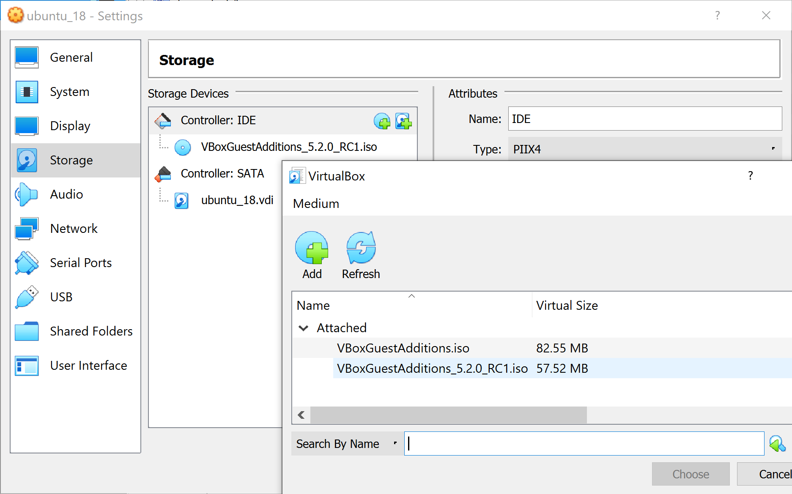
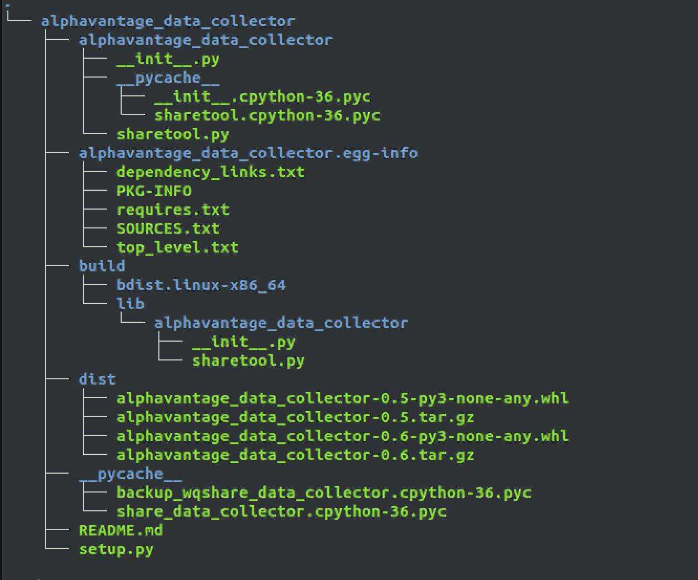
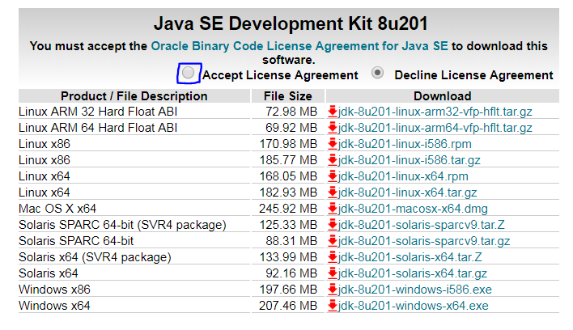
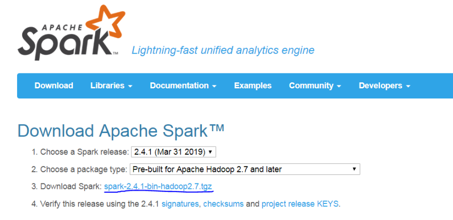
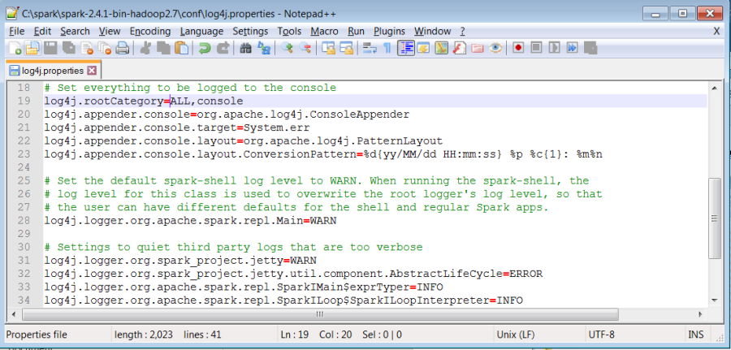
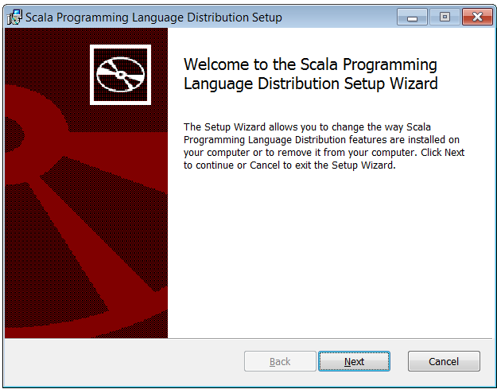
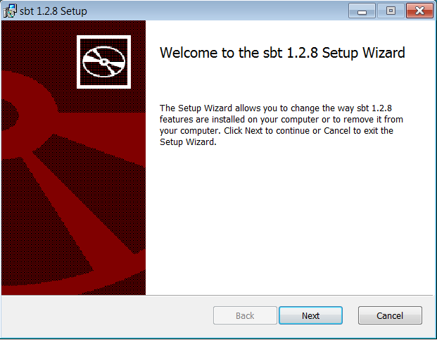

<h1>Table of Contents<span class="tocSkip"></span></h1>
<div class="toc"><ul class="toc-item"><li><span><a href="#Data-Science-Qualifications" data-toc-modified-id="Data-Science-Qualifications-1"><span class="toc-item-num">1&nbsp;&nbsp;</span>Data Science Qualifications</a></span><ul class="toc-item"><li><span><a href="#AWS-Certified-Machine-Learning-Specialty" data-toc-modified-id="AWS-Certified-Machine-Learning-Specialty-1.1"><span class="toc-item-num">1.1&nbsp;&nbsp;</span>AWS Certified Machine Learning Specialty</a></span><ul class="toc-item"><li><span><a href="#Useful-Links" data-toc-modified-id="Useful-Links-1.1.1"><span class="toc-item-num">1.1.1&nbsp;&nbsp;</span>Useful Links</a></span><ul class="toc-item"><li><span><a href="#Official-exam-page-and-AWS-prep-material" data-toc-modified-id="Official-exam-page-and-AWS-prep-material-1.1.1.1"><span class="toc-item-num">1.1.1.1&nbsp;&nbsp;</span>Official exam page and AWS prep material<br></a></span></li><li><span><a href="#Linux-Academy-gives-you-access-to-an-AWS-console-to-participate-in-interacgtive-labs" data-toc-modified-id="Linux-Academy-gives-you-access-to-an-AWS-console-to-participate-in-interacgtive-labs-1.1.1.2"><span class="toc-item-num">1.1.1.2&nbsp;&nbsp;</span>Linux Academy gives you access to an AWS console to participate in interacgtive labs<br></a></span></li><li><span><a href="#A-cloud-guru-has-an-excellent-exam-simulator-to-practice-exam-type-questions" data-toc-modified-id="A-cloud-guru-has-an-excellent-exam-simulator-to-practice-exam-type-questions-1.1.1.3"><span class="toc-item-num">1.1.1.3&nbsp;&nbsp;</span>A cloud guru has an excellent exam simulator to practice exam type questions<br></a></span></li><li><span><a href="#Useful-blog-on-exam-preparation" data-toc-modified-id="Useful-blog-on-exam-preparation-1.1.1.4"><span class="toc-item-num">1.1.1.4&nbsp;&nbsp;</span>Useful blog on exam preparation<br></a></span></li><li><span><a href="#crash-course-from-o'reilly-online-learning-along-with-associated-links-and-material" data-toc-modified-id="crash-course-from-o'reilly-online-learning-along-with-associated-links-and-material-1.1.1.5"><span class="toc-item-num">1.1.1.5&nbsp;&nbsp;</span>crash course from o'reilly online learning along with associated links and material<br></a></span></li></ul></li></ul></li><li><span><a href="#CRT020-Databricks-Certified-Associate-Developer-for-Apache-Spark-2.4-with-Scala-2.11" data-toc-modified-id="CRT020-Databricks-Certified-Associate-Developer-for-Apache-Spark-2.4-with-Scala-2.11-1.2"><span class="toc-item-num">1.2&nbsp;&nbsp;</span>CRT020 Databricks Certified Associate Developer for Apache Spark 2.4 with Scala 2.11</a></span><ul class="toc-item"><li><span><a href="#Useful-Links" data-toc-modified-id="Useful-Links-1.2.1"><span class="toc-item-num">1.2.1&nbsp;&nbsp;</span>Useful Links</a></span><ul class="toc-item"><li><span><a href="#Official-exam-page" data-toc-modified-id="Official-exam-page-1.2.1.1"><span class="toc-item-num">1.2.1.1&nbsp;&nbsp;</span>Official exam page<br></a></span></li><li><span><a href="#Exam-booking-details" data-toc-modified-id="Exam-booking-details-1.2.1.2"><span class="toc-item-num">1.2.1.2&nbsp;&nbsp;</span>Exam booking details<br></a></span></li><li><span><a href="#Study-guide" data-toc-modified-id="Study-guide-1.2.1.3"><span class="toc-item-num">1.2.1.3&nbsp;&nbsp;</span>Study guide<br></a></span></li><li><span><a href="#Blog-on-linkedin-with-detailed-prep-notes" data-toc-modified-id="Blog-on-linkedin-with-detailed-prep-notes-1.2.1.4"><span class="toc-item-num">1.2.1.4&nbsp;&nbsp;</span>Blog on linkedin with detailed prep notes<br></a></span></li><li><span><a href="#Useful-FAQ-answers-for-exam" data-toc-modified-id="Useful-FAQ-answers-for-exam-1.2.1.5"><span class="toc-item-num">1.2.1.5&nbsp;&nbsp;</span>Useful FAQ answers for exam</a></span></li></ul></li></ul></li></ul></li><li><span><a href="#Linux" data-toc-modified-id="Linux-2"><span class="toc-item-num">2&nbsp;&nbsp;</span>Linux</a></span><ul class="toc-item"><li><span><a href="#Virtual-Box" data-toc-modified-id="Virtual-Box-2.1"><span class="toc-item-num">2.1&nbsp;&nbsp;</span>Virtual Box</a></span><ul class="toc-item"><li><span><a href="#Using-vboxmanage-to-configure-virtualbox" data-toc-modified-id="Using-vboxmanage-to-configure-virtualbox-2.1.1"><span class="toc-item-num">2.1.1&nbsp;&nbsp;</span>Using vboxmanage to configure virtualbox<br></a></span></li><li><span><a href="#Increase-size-of-VM-partition" data-toc-modified-id="Increase-size-of-VM-partition-2.1.2"><span class="toc-item-num">2.1.2&nbsp;&nbsp;</span>Increase size of VM partition</a></span></li></ul></li><li><span><a href="#Setup-PATH-variable-correctly" data-toc-modified-id="Setup-PATH-variable-correctly-2.2"><span class="toc-item-num">2.2&nbsp;&nbsp;</span>Setup PATH variable correctly<br></a></span></li><li><span><a href="#Immediate-activation-of-any-path-updates-without-closing-session" data-toc-modified-id="Immediate-activation-of-any-path-updates-without-closing-session-2.3"><span class="toc-item-num">2.3&nbsp;&nbsp;</span>Immediate activation of any path updates without closing session<br></a></span></li><li><span><a href="#Symbolic-links" data-toc-modified-id="Symbolic-links-2.4"><span class="toc-item-num">2.4&nbsp;&nbsp;</span>Symbolic links</a></span></li><li><span><a href="#Linux-Server" data-toc-modified-id="Linux-Server-2.5"><span class="toc-item-num">2.5&nbsp;&nbsp;</span>Linux Server</a></span></li><li><span><a href="#SSH-Notes" data-toc-modified-id="SSH-Notes-2.6"><span class="toc-item-num">2.6&nbsp;&nbsp;</span>SSH Notes</a></span></li><li><span><a href="#Common-Bugs" data-toc-modified-id="Common-Bugs-2.7"><span class="toc-item-num">2.7&nbsp;&nbsp;</span>Common Bugs</a></span><ul class="toc-item"><li><span><a href="#write-on-sudo-owned-file-when-did’nt-use-sudo-to-open" data-toc-modified-id="write-on-sudo-owned-file-when-did’nt-use-sudo-to-open-2.7.1"><span class="toc-item-num">2.7.1&nbsp;&nbsp;</span>write on sudo owned file when did’nt use sudo to open<br></a></span></li><li><span><a href="#Colour-scheme" data-toc-modified-id="Colour-scheme-2.7.2"><span class="toc-item-num">2.7.2&nbsp;&nbsp;</span>Colour scheme<br></a></span></li><li><span><a href="#Apt-get-stalling-on-waiting-for-headers" data-toc-modified-id="Apt-get-stalling-on-waiting-for-headers-2.7.3"><span class="toc-item-num">2.7.3&nbsp;&nbsp;</span>Apt-get stalling on waiting for headers<br></a></span></li><li><span><a href="#Problems-with-Linux-software-updater" data-toc-modified-id="Problems-with-Linux-software-updater-2.7.4"><span class="toc-item-num">2.7.4&nbsp;&nbsp;</span>Problems with Linux software updater<br></a></span></li></ul></li><li><span><a href="#Docker" data-toc-modified-id="Docker-2.8"><span class="toc-item-num">2.8&nbsp;&nbsp;</span>Docker</a></span><ul class="toc-item"><li><span><a href="#Install-docker" data-toc-modified-id="Install-docker-2.8.1"><span class="toc-item-num">2.8.1&nbsp;&nbsp;</span>Install docker</a></span></li><li><span><a href="#Docker-commands" data-toc-modified-id="Docker-commands-2.8.2"><span class="toc-item-num">2.8.2&nbsp;&nbsp;</span>Docker commands</a></span></li><li><span><a href="#Docker-Compose-commands" data-toc-modified-id="Docker-Compose-commands-2.8.3"><span class="toc-item-num">2.8.3&nbsp;&nbsp;</span>Docker-Compose commands</a></span></li></ul></li></ul></li><li><span><a href="#Python" data-toc-modified-id="Python-3"><span class="toc-item-num">3&nbsp;&nbsp;</span>Python</a></span><ul class="toc-item"><li><span><a href="#Useful-links" data-toc-modified-id="Useful-links-3.1"><span class="toc-item-num">3.1&nbsp;&nbsp;</span>Useful links</a></span></li><li><span><a href="#Virtual-Environments" data-toc-modified-id="Virtual-Environments-3.2"><span class="toc-item-num">3.2&nbsp;&nbsp;</span>Virtual Environments</a></span><ul class="toc-item"><li><span><a href="#Install-virtualenv-and-virtualenvwrapper" data-toc-modified-id="Install-virtualenv-and-virtualenvwrapper-3.2.1"><span class="toc-item-num">3.2.1&nbsp;&nbsp;</span>Install virtualenv and virtualenvwrapper<br></a></span></li><li><span><a href="#Wrapper-syntax" data-toc-modified-id="Wrapper-syntax-3.2.2"><span class="toc-item-num">3.2.2&nbsp;&nbsp;</span>Wrapper syntax<br></a></span></li><li><span><a href="#Virtualenv-syntax" data-toc-modified-id="Virtualenv-syntax-3.2.3"><span class="toc-item-num">3.2.3&nbsp;&nbsp;</span>Virtualenv syntax<br></a></span></li><li><span><a href="#Conda-syntax" data-toc-modified-id="Conda-syntax-3.2.4"><span class="toc-item-num">3.2.4&nbsp;&nbsp;</span>Conda syntax</a></span></li><li><span><a href="#Pip-setup" data-toc-modified-id="Pip-setup-3.2.5"><span class="toc-item-num">3.2.5&nbsp;&nbsp;</span>Pip setup<br></a></span></li></ul></li><li><span><a href="#IDE-Tips" data-toc-modified-id="IDE-Tips-3.3"><span class="toc-item-num">3.3&nbsp;&nbsp;</span>IDE Tips</a></span><ul class="toc-item"><li><span><a href="#Vim" data-toc-modified-id="Vim-3.3.1"><span class="toc-item-num">3.3.1&nbsp;&nbsp;</span>Vim</a></span></li><li><span><a href="#Jupyter" data-toc-modified-id="Jupyter-3.3.2"><span class="toc-item-num">3.3.2&nbsp;&nbsp;</span>Jupyter</a></span></li><li><span><a href="#Jupyter-server" data-toc-modified-id="Jupyter-server-3.3.3"><span class="toc-item-num">3.3.3&nbsp;&nbsp;</span>Jupyter server</a></span></li><li><span><a href="#Pycharm" data-toc-modified-id="Pycharm-3.3.4"><span class="toc-item-num">3.3.4&nbsp;&nbsp;</span>Pycharm</a></span></li></ul></li><li><span><a href="#Data-Collection" data-toc-modified-id="Data-Collection-3.4"><span class="toc-item-num">3.4&nbsp;&nbsp;</span>Data Collection</a></span><ul class="toc-item"><li><span><a href="#Web-Scraping/Crawling" data-toc-modified-id="Web-Scraping/Crawling-3.4.1"><span class="toc-item-num">3.4.1&nbsp;&nbsp;</span>Web Scraping/Crawling</a></span><ul class="toc-item"><li><span><a href="#Basic-xpath-syntax" data-toc-modified-id="Basic-xpath-syntax-3.4.1.1"><span class="toc-item-num">3.4.1.1&nbsp;&nbsp;</span>Basic xpath syntax</a></span></li><li><span><a href="#Lxml-Approach-(see-example-scripts)" data-toc-modified-id="Lxml-Approach-(see-example-scripts)-3.4.1.2"><span class="toc-item-num">3.4.1.2&nbsp;&nbsp;</span>Lxml Approach (see example scripts)</a></span></li><li><span><a href="#Scrapy" data-toc-modified-id="Scrapy-3.4.1.3"><span class="toc-item-num">3.4.1.3&nbsp;&nbsp;</span>Scrapy</a></span></li><li><span><a href="#Create-new-project" data-toc-modified-id="Create-new-project-3.4.1.4"><span class="toc-item-num">3.4.1.4&nbsp;&nbsp;</span>Create new project</a></span></li></ul></li></ul></li><li><span><a href="#Data-formatting/Wrangling" data-toc-modified-id="Data-formatting/Wrangling-3.5"><span class="toc-item-num">3.5&nbsp;&nbsp;</span>Data formatting/Wrangling</a></span><ul class="toc-item"><li><span><a href="#Regular-Expressions" data-toc-modified-id="Regular-Expressions-3.5.1"><span class="toc-item-num">3.5.1&nbsp;&nbsp;</span>Regular Expressions</a></span><ul class="toc-item"><li><span><a href="#Useful-Links" data-toc-modified-id="Useful-Links-3.5.1.1"><span class="toc-item-num">3.5.1.1&nbsp;&nbsp;</span>Useful Links</a></span></li></ul></li><li><span><a href="#String-formatting" data-toc-modified-id="String-formatting-3.5.2"><span class="toc-item-num">3.5.2&nbsp;&nbsp;</span>String formatting</a></span></li><li><span><a href="#Pandas-data-formatting" data-toc-modified-id="Pandas-data-formatting-3.5.3"><span class="toc-item-num">3.5.3&nbsp;&nbsp;</span>Pandas data formatting</a></span><ul class="toc-item"><li><span><a href="#prevent-Setting-WithCopyWarning-in-pandas" data-toc-modified-id="prevent-Setting-WithCopyWarning-in-pandas-3.5.3.1"><span class="toc-item-num">3.5.3.1&nbsp;&nbsp;</span>prevent Setting WithCopyWarning in pandas</a></span></li><li><span><a href="#Show-max-rows-and-columns-inline-for-pandas-dataframes" data-toc-modified-id="Show-max-rows-and-columns-inline-for-pandas-dataframes-3.5.3.2"><span class="toc-item-num">3.5.3.2&nbsp;&nbsp;</span>Show max rows and columns inline for pandas dataframes</a></span></li><li><span><a href="#Read-in-series-of-csv-files-and-concatenate-into-one-csv-file" data-toc-modified-id="Read-in-series-of-csv-files-and-concatenate-into-one-csv-file-3.5.3.3"><span class="toc-item-num">3.5.3.3&nbsp;&nbsp;</span>Read in series of csv files and concatenate into one csv file</a></span></li></ul></li></ul></li><li><span><a href="#Visualisations" data-toc-modified-id="Visualisations-3.6"><span class="toc-item-num">3.6&nbsp;&nbsp;</span>Visualisations</a></span><ul class="toc-item"><li><span><a href="#Graph-Database-Packages" data-toc-modified-id="Graph-Database-Packages-3.6.1"><span class="toc-item-num">3.6.1&nbsp;&nbsp;</span>Graph Database Packages</a></span><ul class="toc-item"><li><span><a href="#Gephi-(graph-creator)-and-Yed-(graph-visualiser)" data-toc-modified-id="Gephi-(graph-creator)-and-Yed-(graph-visualiser)-3.6.1.1"><span class="toc-item-num">3.6.1.1&nbsp;&nbsp;</span>Gephi (graph creator) and Yed (graph visualiser)</a></span></li></ul></li><li><span><a href="#Using-ipywidgets-to-give-interactive-graphs" data-toc-modified-id="Using-ipywidgets-to-give-interactive-graphs-3.6.2"><span class="toc-item-num">3.6.2&nbsp;&nbsp;</span>Using ipywidgets to give interactive graphs</a></span></li></ul></li><li><span><a href="#Productionisation-of-code" data-toc-modified-id="Productionisation-of-code-3.7"><span class="toc-item-num">3.7&nbsp;&nbsp;</span>Productionisation of code</a></span><ul class="toc-item"><li><span><a href="#python-pip-package-method-with-GitHub" data-toc-modified-id="python-pip-package-method-with-GitHub-3.7.1"><span class="toc-item-num">3.7.1&nbsp;&nbsp;</span>python pip package method with GitHub</a></span><ul class="toc-item"><li><span><a href="#Create-pip-package" data-toc-modified-id="Create-pip-package-3.7.1.1"><span class="toc-item-num">3.7.1.1&nbsp;&nbsp;</span>Create pip package</a></span></li></ul></li><li><span><a href="#python-pip-package-method-with-Docker,-TeamCity-and-Artifactory" data-toc-modified-id="python-pip-package-method-with-Docker,-TeamCity-and-Artifactory-3.7.2"><span class="toc-item-num">3.7.2&nbsp;&nbsp;</span>python pip package method with Docker, TeamCity and Artifactory</a></span><ul class="toc-item"><li><span><a href="#Useful-links" data-toc-modified-id="Useful-links-3.7.2.1"><span class="toc-item-num">3.7.2.1&nbsp;&nbsp;</span>Useful links<br></a></span></li></ul></li><li><span><a href="#Example-usage-(stock_data_collector)" data-toc-modified-id="Example-usage-(stock_data_collector)-3.7.3"><span class="toc-item-num">3.7.3&nbsp;&nbsp;</span>Example usage (stock_data_collector)</a></span></li><li><span><a href="#Deploy-package-from-Cloudera-to-artifactory" data-toc-modified-id="Deploy-package-from-Cloudera-to-artifactory-3.7.4"><span class="toc-item-num">3.7.4&nbsp;&nbsp;</span>Deploy package from Cloudera to artifactory</a></span></li><li><span><a href="#AWS-Batch-method" data-toc-modified-id="AWS-Batch-method-3.7.5"><span class="toc-item-num">3.7.5&nbsp;&nbsp;</span>AWS Batch method</a></span><ul class="toc-item"><li><span><a href="#Docker-container-of-code" data-toc-modified-id="Docker-container-of-code-3.7.5.1"><span class="toc-item-num">3.7.5.1&nbsp;&nbsp;</span>Docker container of code</a></span></li><li><span><a href="#TeamCity" data-toc-modified-id="TeamCity-3.7.5.2"><span class="toc-item-num">3.7.5.2&nbsp;&nbsp;</span>TeamCity</a></span></li><li><span><a href="#Octopus" data-toc-modified-id="Octopus-3.7.5.3"><span class="toc-item-num">3.7.5.3&nbsp;&nbsp;</span>Octopus</a></span></li><li><span><a href="#AWS-Lambda" data-toc-modified-id="AWS-Lambda-3.7.5.4"><span class="toc-item-num">3.7.5.4&nbsp;&nbsp;</span>AWS Lambda</a></span></li><li><span><a href="#AWS-Batch" data-toc-modified-id="AWS-Batch-3.7.5.5"><span class="toc-item-num">3.7.5.5&nbsp;&nbsp;</span>AWS Batch</a></span></li></ul></li></ul></li><li><span><a href="#Communications-packages" data-toc-modified-id="Communications-packages-3.8"><span class="toc-item-num">3.8&nbsp;&nbsp;</span>Communications packages</a></span><ul class="toc-item"><li><span><a href="#Using-ZMQ-pub/sub-model-for-message-transfer" data-toc-modified-id="Using-ZMQ-pub/sub-model-for-message-transfer-3.8.1"><span class="toc-item-num">3.8.1&nbsp;&nbsp;</span>Using ZMQ pub/sub model for message transfer</a></span><ul class="toc-item"><li><span><a href="#Useful-links" data-toc-modified-id="Useful-links-3.8.1.1"><span class="toc-item-num">3.8.1.1&nbsp;&nbsp;</span>Useful links</a></span></li><li><span><a href="#Simple-pub/sub-example-using-sockets" data-toc-modified-id="Simple-pub/sub-example-using-sockets-3.8.1.2"><span class="toc-item-num">3.8.1.2&nbsp;&nbsp;</span>Simple pub/sub example using sockets</a></span></li></ul></li><li><span><a href="#Automatic-email-updates-in-python-using-smtlib" data-toc-modified-id="Automatic-email-updates-in-python-using-smtlib-3.8.2"><span class="toc-item-num">3.8.2&nbsp;&nbsp;</span>Automatic email updates in python using smtlib</a></span><ul class="toc-item"><li><span><a href="#Useful-Links" data-toc-modified-id="Useful-Links-3.8.2.1"><span class="toc-item-num">3.8.2.1&nbsp;&nbsp;</span>Useful Links</a></span></li><li><span><a href="#Import-necessaary-libraries-including-smtlib" data-toc-modified-id="Import-necessaary-libraries-including-smtlib-3.8.2.2"><span class="toc-item-num">3.8.2.2&nbsp;&nbsp;</span>Import necessaary libraries including smtlib</a></span></li><li><span><a href="#Create-the-MIMEMultipart-message-object-and-load-it-with-appropriate-headers-for-From,-To,-and-Subject-fields" data-toc-modified-id="Create-the-MIMEMultipart-message-object-and-load-it-with-appropriate-headers-for-From,-To,-and-Subject-fields-3.8.2.3"><span class="toc-item-num">3.8.2.3&nbsp;&nbsp;</span>Create the MIMEMultipart message object and load it with appropriate headers for From, To, and Subject fields</a></span></li><li><span><a href="#Set-up-the-SMTP-server-and-log-into-your-account" data-toc-modified-id="Set-up-the-SMTP-server-and-log-into-your-account-3.8.2.4"><span class="toc-item-num">3.8.2.4&nbsp;&nbsp;</span>Set up the SMTP server and log into your account</a></span></li><li><span><a href="#Send-the-message-using-the-SMTP-server-object" data-toc-modified-id="Send-the-message-using-the-SMTP-server-object-3.8.2.5"><span class="toc-item-num">3.8.2.5&nbsp;&nbsp;</span>Send the message using the SMTP server object</a></span></li></ul></li></ul></li><li><span><a href="#Web-Server-(Using-Dash,-Flask,-Gunicorn,-Nginz)" data-toc-modified-id="Web-Server-(Using-Dash,-Flask,-Gunicorn,-Nginz)-3.9"><span class="toc-item-num">3.9&nbsp;&nbsp;</span>Web Server (Using Dash, Flask, Gunicorn, Nginz)</a></span><ul class="toc-item"><li><span><a href="#Useful-Links-to-be-checked-and-moved-where-necessary" data-toc-modified-id="Useful-Links-to-be-checked-and-moved-where-necessary-3.9.1"><span class="toc-item-num">3.9.1&nbsp;&nbsp;</span>Useful Links to be checked and moved where necessary</a></span></li></ul></li><li><span><a href="#Web-Server-(Using-Dash,-Flask,-Gunicorn,-Nginz)" data-toc-modified-id="Web-Server-(Using-Dash,-Flask,-Gunicorn,-Nginz)-3.10"><span class="toc-item-num">3.10&nbsp;&nbsp;</span>Web Server (Using Dash, Flask, Gunicorn, Nginz)</a></span><ul class="toc-item"><li><span><a href="#Useful-Links" data-toc-modified-id="Useful-Links-3.10.1"><span class="toc-item-num">3.10.1&nbsp;&nbsp;</span>Useful Links</a></span></li><li><span><a href="#Overview" data-toc-modified-id="Overview-3.10.2"><span class="toc-item-num">3.10.2&nbsp;&nbsp;</span>Overview</a></span><ul class="toc-item"><li><span><a href="#python-application-(like-Dash/Flask)" data-toc-modified-id="python-application-(like-Dash/Flask)-3.10.2.1"><span class="toc-item-num">3.10.2.1&nbsp;&nbsp;</span>python application (like Dash/Flask)</a></span></li><li><span><a href="#A-WSGI-application-server-(like-Gunicorn)" data-toc-modified-id="A-WSGI-application-server-(like-Gunicorn)-3.10.2.2"><span class="toc-item-num">3.10.2.2&nbsp;&nbsp;</span>A WSGI application server (like Gunicorn)</a></span></li><li><span><a href="#A-web-server-(like-nginx)" data-toc-modified-id="A-web-server-(like-nginx)-3.10.2.3"><span class="toc-item-num">3.10.2.3&nbsp;&nbsp;</span>A web server (like nginx)</a></span></li></ul></li><li><span><a href="#Step-by-step-guide-to-building-a-production-ready-web-server" data-toc-modified-id="Step-by-step-guide-to-building-a-production-ready-web-server-3.10.3"><span class="toc-item-num">3.10.3&nbsp;&nbsp;</span>Step by step guide to building a production ready web server</a></span><ul class="toc-item"><li><span><a href="#Prerequisites" data-toc-modified-id="Prerequisites-3.10.3.1"><span class="toc-item-num">3.10.3.1&nbsp;&nbsp;</span>Prerequisites</a></span></li><li><span><a href="#Installing-the-Components-from-the-Ubuntu-Repositories" data-toc-modified-id="Installing-the-Components-from-the-Ubuntu-Repositories-3.10.3.2"><span class="toc-item-num">3.10.3.2&nbsp;&nbsp;</span>Installing the Components from the Ubuntu Repositories</a></span></li><li><span><a href="#Creating-a-Python-Virtual-Environment" data-toc-modified-id="Creating-a-Python-Virtual-Environment-3.10.3.3"><span class="toc-item-num">3.10.3.3&nbsp;&nbsp;</span>Creating a Python Virtual Environment</a></span></li><li><span><a href="#Setting-Up-a-Flask-Application" data-toc-modified-id="Setting-Up-a-Flask-Application-3.10.3.4"><span class="toc-item-num">3.10.3.4&nbsp;&nbsp;</span>Setting Up a Flask Application</a></span></li><li><span><a href="#Creating-a-Sample-App" data-toc-modified-id="Creating-a-Sample-App-3.10.3.5"><span class="toc-item-num">3.10.3.5&nbsp;&nbsp;</span>Creating a Sample App</a></span></li><li><span><a href="#Setup-WSGI-Endpoint" data-toc-modified-id="Setup-WSGI-Endpoint-3.10.3.6"><span class="toc-item-num">3.10.3.6&nbsp;&nbsp;</span>Setup WSGI Endpoint</a></span></li><li><span><a href="#Configuring-Gunicorn" data-toc-modified-id="Configuring-Gunicorn-3.10.3.7"><span class="toc-item-num">3.10.3.7&nbsp;&nbsp;</span>Configuring Gunicorn</a></span></li></ul></li><li><span><a href="#Configuring-Nginx-to-proxy-requests" data-toc-modified-id="Configuring-Nginx-to-proxy-requests-3.10.4"><span class="toc-item-num">3.10.4&nbsp;&nbsp;</span>Configuring Nginx to proxy requests</a></span><ul class="toc-item"><li><span><a href="#Securing-the-Application-with-SSL-encryption-from-Lets-Encrypt" data-toc-modified-id="Securing-the-Application-with-SSL-encryption-from-Lets-Encrypt-3.10.4.1"><span class="toc-item-num">3.10.4.1&nbsp;&nbsp;</span>Securing the Application with SSL encryption from Lets Encrypt</a></span></li><li><span><a href="#Log-out-button-link" data-toc-modified-id="Log-out-button-link-3.10.4.2"><span class="toc-item-num">3.10.4.2&nbsp;&nbsp;</span>Log out button link</a></span></li></ul></li></ul></li></ul></li><li><span><a href="#Scala-and-Spark" data-toc-modified-id="Scala-and-Spark-4"><span class="toc-item-num">4&nbsp;&nbsp;</span>Scala and Spark</a></span><ul class="toc-item"><li><span><a href="#Scalable-data-science" data-toc-modified-id="Scalable-data-science-4.1"><span class="toc-item-num">4.1&nbsp;&nbsp;</span>Scalable data science</a></span></li><li><span><a href="#Useful-links" data-toc-modified-id="Useful-links-4.2"><span class="toc-item-num">4.2&nbsp;&nbsp;</span>Useful links</a></span></li><li><span><a href="#Important-note-on-compatible-verisons" data-toc-modified-id="Important-note-on-compatible-verisons-4.3"><span class="toc-item-num">4.3&nbsp;&nbsp;</span>Important note on compatible verisons</a></span></li><li><span><a href="#Initial-setup-linux" data-toc-modified-id="Initial-setup-linux-4.4"><span class="toc-item-num">4.4&nbsp;&nbsp;</span>Initial setup linux</a></span><ul class="toc-item"><li><span><a href="#Java" data-toc-modified-id="Java-4.4.1"><span class="toc-item-num">4.4.1&nbsp;&nbsp;</span>Java</a></span></li><li><span><a href="#Spark" data-toc-modified-id="Spark-4.4.2"><span class="toc-item-num">4.4.2&nbsp;&nbsp;</span>Spark</a></span></li><li><span><a href="#Hadoop" data-toc-modified-id="Hadoop-4.4.3"><span class="toc-item-num">4.4.3&nbsp;&nbsp;</span>Hadoop</a></span></li><li><span><a href="#Scala" data-toc-modified-id="Scala-4.4.4"><span class="toc-item-num">4.4.4&nbsp;&nbsp;</span>Scala</a></span></li><li><span><a href="#SBT" data-toc-modified-id="SBT-4.4.5"><span class="toc-item-num">4.4.5&nbsp;&nbsp;</span>SBT</a></span></li><li><span><a href="#Check-installations" data-toc-modified-id="Check-installations-4.4.6"><span class="toc-item-num">4.4.6&nbsp;&nbsp;</span>Check installations</a></span></li></ul></li><li><span><a href="#Initial-setup-Windows" data-toc-modified-id="Initial-setup-Windows-4.5"><span class="toc-item-num">4.5&nbsp;&nbsp;</span>Initial setup Windows</a></span><ul class="toc-item"><li><span><a href="#Java" data-toc-modified-id="Java-4.5.1"><span class="toc-item-num">4.5.1&nbsp;&nbsp;</span>Java</a></span></li><li><span><a href="#Spark" data-toc-modified-id="Spark-4.5.2"><span class="toc-item-num">4.5.2&nbsp;&nbsp;</span>Spark</a></span></li><li><span><a href="#winutils-(Hadoop-Support)" data-toc-modified-id="winutils-(Hadoop-Support)-4.5.3"><span class="toc-item-num">4.5.3&nbsp;&nbsp;</span>winutils (Hadoop Support)</a></span></li><li><span><a href="#Scala" data-toc-modified-id="Scala-4.5.4"><span class="toc-item-num">4.5.4&nbsp;&nbsp;</span>Scala</a></span></li><li><span><a href="#SBT" data-toc-modified-id="SBT-4.5.5"><span class="toc-item-num">4.5.5&nbsp;&nbsp;</span>SBT</a></span></li><li><span><a href="#Define-all-the-necessary-path-variables" data-toc-modified-id="Define-all-the-necessary-path-variables-4.5.6"><span class="toc-item-num">4.5.6&nbsp;&nbsp;</span>Define all the necessary path variables</a></span><ul class="toc-item"><li><span><a href="#System-and-user-variables-explained" data-toc-modified-id="System-and-user-variables-explained-4.5.6.1"><span class="toc-item-num">4.5.6.1&nbsp;&nbsp;</span>System and user variables explained</a></span></li></ul></li></ul></li><li><span><a href="#Check-installation-of-Spark" data-toc-modified-id="Check-installation-of-Spark-4.6"><span class="toc-item-num">4.6&nbsp;&nbsp;</span>Check installation of Spark</a></span></li><li><span><a href="#IDE-Setup" data-toc-modified-id="IDE-Setup-4.7"><span class="toc-item-num">4.7&nbsp;&nbsp;</span>IDE Setup</a></span><ul class="toc-item"><li><span><a href="#intellij-IDEA" data-toc-modified-id="intellij-IDEA-4.7.1"><span class="toc-item-num">4.7.1&nbsp;&nbsp;</span>intellij IDEA</a></span><ul class="toc-item"><li><span><a href="#Windows-install" data-toc-modified-id="Windows-install-4.7.1.1"><span class="toc-item-num">4.7.1.1&nbsp;&nbsp;</span>Windows install</a></span></li><li><span><a href="#Linux-install" data-toc-modified-id="Linux-install-4.7.1.2"><span class="toc-item-num">4.7.1.2&nbsp;&nbsp;</span>Linux install</a></span></li></ul></li><li><span><a href="#Polynote" data-toc-modified-id="Polynote-4.7.2"><span class="toc-item-num">4.7.2&nbsp;&nbsp;</span>Polynote</a></span></li><li><span><a href="#Zeppelin-notebooks" data-toc-modified-id="Zeppelin-notebooks-4.7.3"><span class="toc-item-num">4.7.3&nbsp;&nbsp;</span>Zeppelin notebooks</a></span><ul class="toc-item"><li><span><a href="#Setup-for-local-zeppelin-(without-docker)" data-toc-modified-id="Setup-for-local-zeppelin-(without-docker)-4.7.3.1"><span class="toc-item-num">4.7.3.1&nbsp;&nbsp;</span>Setup for local zeppelin (without docker)</a></span></li><li><span><a href="#Convert-between-databricks,-JSON-and-Zeppelin-notebook-files-using-Pinot" data-toc-modified-id="Convert-between-databricks,-JSON-and-Zeppelin-notebook-files-using-Pinot-4.7.3.2"><span class="toc-item-num">4.7.3.2&nbsp;&nbsp;</span>Convert between databricks, JSON and Zeppelin notebook files using Pinot</a></span></li></ul></li></ul></li></ul></li><li><span><a href="#Sagemath" data-toc-modified-id="Sagemath-5"><span class="toc-item-num">5&nbsp;&nbsp;</span>Sagemath</a></span></li></ul></div>

# Data Science Qualifications

## AWS Certified Machine Learning Specialty

### Useful Links

#### Official exam page and AWS prep material<br>
https://aws.amazon.com/certification/certified-machine-learning-specialty/<br>
https://www.aws.training/Certification<br>
https://aws.amazon.com/training/learning-paths/machine-learning/exam-preparation/<br>
https://aws.amazon.com/training/learning-paths/machine-learning/data-scientist/<br>
https://docs.aws.amazon.com/sagemaker/latest/dg/sagemaker-dg.pdf<br>
#### Linux Academy gives you access to an AWS console to participate in interacgtive labs<br>
https://linuxacademy.com/course/aws-certified-machine-learning-specialty/<br>
#### A cloud guru has an excellent exam simulator to practice exam type questions<br>
https://learn.acloud.guru/course/aws-certified-machine-learning-specialty/dashboard<br>
#### Useful blog on exam preparation<br>
https://blog.thecloudtutor.com/2019/03/18/Passing-the-AWS-Certified-Machine-Learning-Specialty-Exam-MLS-C01.html<br>
https://medium.com/@javier.ramos1/aws-machine-learning-certification-exam-tips-2a7679a83e73<br>
#### crash course from o'reilly online learning along with associated links and material<br>
https://www.oreilly.com/library/view/aws-certified-machine/9780135556597/<br>
https://learning.oreilly.com/live-training/courses/aws-machine-learning-specialty-certification-crash-course/0636920259589/<br>
https://github.com/noahgift/aws-ml-guide<br>
https://noahgift.github.io/aws-ml-guide/intro<br>
https://www.qwiklabs.com/quests/5<Br>
https://www.oreilly.com/library/view/aws-certified-machine/9780135556597/<br>
    
## CRT020 Databricks Certified Associate Developer for Apache Spark 2.4 with Scala 2.11

### Useful Links
#### Official exam page<br>
https://academy.databricks.com/category/certifications<br>
#### Exam booking details<br>
https://www.kryteriononline.com/sites/default/files/docs/PreparingForYourExam.pdf<br>
https://go.proctoru.com/students/order<br>
#### Study guide<br>
https://www.linkedin.com/pulse/spark-simplified-certification-study-guide-raki-rahman/
#### Blog on linkedin with detailed prep notes<br>
https://www.linkedin.com/pulse/all-you-need-clear-crt020-databricks-certified-associate-kumar<br>
https://www.linkedin.com/pulse/spark-simplified-certification-study-guide-raki-rahman/
#### Useful FAQ answers for exam
https://forums.databricks.com/questions/20492/has-anyone-taken-crt020-databricks-certified-assoc.html#answer-container-20719<br>
https://forums.databricks.com/questions/29588/when-taking-the-2019-crt020-scalaspark-certificati.html<br>

# Linux

## Virtual Box
Steps to build linux ubuntu virtual machine:
   
1) Enable virtualisation on bios<br>
2) Download latest version of Ubuntu (64 bit version) as disk image from https://ubuntu.com/download/desktop<br>
3) Download latest version of Oracle VirtualBox from https://www.virtualbox.org/ and install.<br>
4) Setup virtual machine using VirtualBox using Ubuntu disk image as chosen OS.<br>
5) Install VirtualBox Guest-additions. __Install Guest Additions 5.2.4 manually as 6.0 does not work with symbolic      links to host OS.__ 
   To install manually download the iso file from https://download.virtualbox.org/virtualbox/5.2.0_RC1/ 
   and then choose it in the mount in Virtualbox.



__Enabling best performance for full screen on second monitor__<br>
In VB Manager---settings---display ensure:
Video memory=128MB

__Enabling copy and paste__<br>
Install VirtualBox guest additions<br>
In VM go to Devices --- Insert Guest Additions CD image.<br>
Then go to devices---shared clipboard and set to bidirectional<br>
Then go to devices---drag and drop and set to bidirectional<br>


__Manually mount shared folder__<br>
Sudo mount -t vboxsf SHARED_FOLDER_NAME MOUNT_LOCATION


__Allow access to shared folder from linux__<br>
Add user to group<br>
sudo usermod -aG vboxsf username<br>

__Change home directory to shared folder__
Add below line to .bashrc file
`cd /home/martin/shared_folder`

__Allow drag and drop__
At top left of VM window Go to Devices then Drag and Drop then select Bidirectional

__Install dpkg and associated packages__
`sudo apt-get install dpkg`
`sudo apt-get install virtualbox-guest-gkms virtualbox-guest-utils virtualbox-guest-x11`

### Using vboxmanage to configure virtualbox<br>

__IMPORTANT NOTES:__<br>
1.Guest Additions 6.0 does not work with below commands use Guest Additions 5.2.4<br>
2.Make sure virtualbox is set to permanently run as an administrator<br>
3.vboxmanage and VBoxManage both work, its not case sensitive<br>


__Allow symbolic links in shared folder (For virtualenv etc)__<br>
In command prompt in windows change to directory<br>
`C:/Program Files/Oracle/VirtualBox`<br>
Then run command below replacing `VM_NAME` with name of virtualbox machine.
(part in bold is full path to shared folder as it appears in virtualbox menu)


`vboxmanage setextradata VM_NAME VBoxInternal2/SharedFoldersEnableSymlinksCreate/PATH_TO_SHARED_FOLDER 1`<br>


__If above code doesnt work try shared folder name with no filepath__
`vboxmanage setextradata VM_NAME VBoxInternal2/SharedFoldersEnableSymlinksCreate/SHARED_FOLDER 1`


__To check current symbolic links__<br>
`vboxmanage getextradata VM_NAME enumerate`
 
__Example output__


__Change location of shared folder__<br>
`Vboxmanage guestproperty set VM_NAME /VirtualBox/GuestAdd/SharedFolders/MountDir /home/user/`
<br>
__Remove sf_ prefix from shared folder__<br>
`vboxmanage guestproperty set VM_NAME /VirtualBox/GuestAdd/SharedFolders/MountPrefix /`
<br>

__Check location and prefix shared folder details__<br>
`Vboxmanage guestproperty enumerate VM_NAME`<br>

__Example output__


### Increase size of VM partition

Follow instructions on below link
http://derekmolloy.ie/resize-a-virtualbox-disk/#prettyPhoto

Make sure to connect correct new .vdi file afterwards to your VM as below.


## Setup PATH variable correctly<br>
__PATH__: A list of directories that the system will check when looking for commands. When a user types in a command, the system will check directories in this order for the executable.<br>
https://www.digitalocean.com/community/tutorials/how-to-read-and-set-environmental-and-shell-variables-on-a-linux-vps<br>

Vim environment file in etc folder and check if contents same as below<br>
`PATH="/usr/local/sbin:/usr/local/bin:/usr/sbin:/usr/bin:/sbin:/bin:/usr/games:/usr/local/games"`<br>

## Immediate activation of any path updates without closing session<br>
`source /etc/environment && export PATH`<br>

Can also update the __PATH__ in `.profile` or `.bashrc` files but environment best way to do it<br>

## Symbolic links
__Create symbolic link to python 3__<br>
`Sudo ln -s /usr/python3 /usr/bin/python`<br>
<pre>          TARGET       LINK_NAME</pre>

<font color=red>DANGER:</font> Don not symbolic link ‘python’ to ‘python3’ as linux system needs python2 for some processes and its uses python as its command syntax. Instead use as alias in .bashrc like
alias python=python3


__Create symbolic link to virtual env activation file__
ln -s  ~/Desktop/virtualenvs/py3/bin/activate  ~/py3_env

## Linux Server

__find job on certain port__<br>
`lsof -t -i :PORT_NUMBER`

__SCP copying__<br>
copy files from local to remote<br>
Note this copies to the root folder of the server as no filepath given after the address:
`pscp -r FILEPATH_TO_ORIGINAL_FILE root@IP_ADDRESS:`

copy files from remote to local<br>
`pscp root@IP_ADDRESS:FILEPATH_TO_ORIGINAL_FILE FILEPATH_TO_DESTINATION:`

__Adding Additional Users__<br>
Important note: After any changes to sshd_config in below instructions ensure update is activated<br>
`sudo service ssh reload`

__Allow password authorization__<br>
Go to `/etc/ssh/sshd_config` and update line below yes<br>
`PasswordAuthentication yes`

__Add new user called mmcgov__
add new user and set no home directory as want same home directory as root. Specify home directory as root. 
Add any groups which contain the files they need to access and make sure to add them to sudo group.<br>
`adduser --home /root --shell /bin/bash --no-create-home --ingroup GROUP_NAME --ingroup sudo`<br>

•	`adduser` is used to add a user<br>
•	`--home` specifies home directory which is where the user will be when they log in<br>
•	`--shell` is to specify the shell, by default it is usually just `/bin/sh` which is not as user friendly as `/bin/bash`<br>
•	`--no-create-home` will not create the home directory so you must use one that already exists<br>
•	`--ingroup` adds the user to specified group (see below need to create group first)<br>
•	the last argument is the username<br>
•	__NOTE__: group is created in act of using chown so need to do this first before assigning group to user
You will be asked to create password, you can hit return to skip rest of required information

__Add user to specific group__
`sudo usermod -a -G GROUPNAME USERNAME`

__check which groups a user in__
`groups USERNAME`

__check which groups all user__
`vim /etc/group`

__Login as new user and setup__
ssh as below, you will be prompted for password<br>
`ssh USERNAME@ip_address`<br>
go to home default directory and create new directory<br>  
`~/.ssh`
Create new file in this folder called `authorized_keys` and paste in `public key` from root profile. 

__Forbid password authentication__
PasswordAuthentication no<br>

__Check home directory for each user__
Look for all users in `/etc/passwd`<br>
Alternatively use below command<br>
`awk -F: '{print$1}' /etc/passwd`

__Remove a user__<br>
`userdel USER_NAME`

__Granting access for user to certain directories__<br>
First change group of files you want to share to new group which new user will be part of<br>
`chown     root:gemini    chosen_folder/`<br>
first name is owner (root) second is group (gemini) last part is file directory. 

__grant access recursively to directories__<br>
`chmod -R 755 root/`

__Codes for access explained__
7 = 4+2+1 (read/write/execute)<br>
6 = 4+2 (read/write)<br>
5 = 4+1 (read/execute)<br>
4 = 4 (read)<br>
3 = 2+1 (write/execute)<br>
2 = 2 (write)<br>
1 = 1 (execute)<br>

__Alternative symbolic method of changing chmod explained__<br>
The first and probably easiest way is the relative (or symbolic) method, which lets you specify access classes and types with single letter abbreviations. A chmod command with this form of syntax consists of at least three parts from the following lists:

__Access Class__<br>
u(User), g(group), o(other), a(all:u, g and o)<br>
__Operator__<br>
+(add access), -(remove access), =(set exact access)<br>
__Access__<br>
r(read), w(write), x(execute)<br>
<br>
__Examples__<br>
To add read access for all on testfile<br>
`chmod a+r testfile`<br>


To remove read and write access for user and others on testfile<br>
`chmod uo-w testfile`<br>

To explicitly set read access for other on testfile<br>
`chmod o=r testfile`<br>

For more help/details on chmod<br>
`man chmod`


## SSH Notes

__useful links__<br>
https://www.digitalocean.com/community/tutorials/initial-server-setup-with-ubuntu-18-04<br>

__log onto remote server__<br>
`ssh root@ip_address`

__Create ssh key__
`ssh-keygen -t rsa -b 4096 -C "USER@EMAIL"`<br>
keys are saved at `~/.ssh`

__view contents of ssh file to copy key__<br>
`cat ~/.ssh/id_rsa.pub`

Once key copied to server should be able to log in without need for password

__Setting up ssh on second laptop__<br>
Copy .ssh file from old home directory to home directory on new computer<br>
ensure permissions inside .ssh are as follow<br>
id_rsa = rw,-,-  (sudo chmod 6,0,0)<br>
id_rsa.pub=rw,r,r (sudo chmod 6,4,4)<br>
known_hosts=rw,r,r (sudo chmod 6,4,4)<br>


__Using ssh as localhost__<br>
`ssh-keygen -t rsa -b 4096 -C "USER@EMAIL"`<br>
`cat ~/.ssh/id_rsa.pub >> ~/.ssh/authorized_keys`<br>
`chmod 0600 ~/.ssh/authorized_keys`<br>
Then try:
`ssh localhost`


## Common Bugs
### write on sudo owned file when did’nt use sudo to open<br>
`:w ! sudo tee %`

### Colour scheme<br>
Restore defaults<br> 
`gsettings reset org.gnome.desktop.interface gtk-theme`<br>
`gsettings reset org.gnome.desktop.interface icon-theme`<br>

### Apt-get stalling on waiting for headers<br>
If apt-get update not working and stalling while waiting for headers try changing sources.list file in `etc/apt/` to different prefix instead of
`deb http://ie.archive.ubuntu.com/ubuntu/ bionic main restricted`
change to 
`deb http://eng.archive.ubuntu.com/ubuntu/ bionic main restricted`
If this does not fix then see below for changing default repo for linux


### Problems with Linux software updater<br>
Untick below repo as can cause problems with updates
`https://packages.microsoft.com/ubuntu/16.04/mssql-server xenial main`
only these 3 packages should be ticked
`https://packages.microsoft.com/ubuntu/16.04/mssql-server-2017 xenial main(Source Code)`
`http://dl.google.com/linux/chrome/deb/ stable main`
`https://packages.microsoft.com/ubuntu/16.04/prod xenial main`
Can check which repos not working by just running updater

## Docker

### Install docker
`Pip install docker-compose`<br>
`Pip install docker`<br>
`Sudo apt install docker.io`<br>

`sudo chmod +x /usr/local/bin/docker-compose`<br>
`sudo usermod -aG docker USER_NAME`<br>

### Docker commands
(Vim into Makefile for basic commands)

__Enter docker container__
`./dockercmd.sh bash`<br>
(Problems with docker command make dev bash then Cat dockercmd.sh and run single line of code without bash lines)<br>

__Install packages in docker__
Add following to Dockerfile for useful system packages. Can run once in the ‘make build’ and then comment out.
 `RUN apt-get update -y && apt-get -o Dpkg::Options::="--force-overwrite"` 


      
### Docker-Compose commands

To start docker run this from inside docker directory<br>
`Docker-compose up -d`<br>

To stop docker<br>
`Docker-compose down`<br>

list size of containers, objects etc<br>
`sudo du -h --max-depth=1`<br>
Clean up docker related items<br>
`docker system prune -a` <br>

# Python

## Useful links
Magic Commands<br>
https://ipython.org/ipython-doc/3/interactive/magics.html#line-magics
Coding tips<br>
https://powerfulpython.com/safari-trainings/<br>

## Virtual Environments

It is good practice to setup virtual environments for each project so that the requirements/dependencies can be keep isolated for that project and not becomne interwined with the base linux python version which is used for critical system processses.


https://medium.com/@__pamaron__/understanding-and-use-python-virtualenvs-from-data-scientist-perspective-bfed61faeb3f<br>

https://favoorr.github.io/2017/01/03/python3-6-virtualenvwrapper-problem-md/<br>


### Install virtualenv and virtualenvwrapper<br>
`Sudo pip install virtualenv`

`sudo pip install virtualenvwrapper`

Should really be installed via sudo to be available to all but if only local then can<br>
`Pip install virtualenv`<br>
`Pip install virtualenvwrapper`<br>

In the case of virtualenv wrapper you also need to add the following lines to the .bashrc.<br>

`export VIRTUALENVWRAPPER_VIRTUALENV=/usr/local/bin/virtualenv`<br>
`source /usr/local/bin/virtualenvwrapper.sh`<br>

__NOTE__<br>
If having difficulties with symbolic links on shared folder of VM for example then use flag --always-copy to vreate a virtualenv without symlinks where all the executables are copied into the new env.<br>

### Wrapper syntax<br>
https://howchoo.com/g/nwewzjmzmjc/a-guide-to-python-virtual-environments-with-virtualenvwrapper

__Create new virtualenv called py3 with python 3.6 installed__
`mkvirtualenv -p /usr/bin/python3.6 py3`<br>
This creates virtualenv in ~/.virtualenvs

__To list all virtualenvs:__
`lsvirtualenv`

__to enter virtualenv:__
`workon py3`

__exit virtualenv__
`deactivate`

__remove virtualenv__
`rmvirtualenv py3`


### Virtualenv syntax<br>

__create new environment__<br>
`virtualenv ENVNAME`<br>

__activate virtualenv__
example for env named py2<br>
`source ~/Desktop/virtualenvs/py2/bin/activate`<br>

Create symbolic link to virtual env activation file to save typing full path<br>
`ln -s  ~/Desktop/virtualenvs/py3/bin/activate  ~/py3_env`

can then simply use:<br>
`source ~/py3_env`

__deactivate virtualenv__<br>
`deactivate`

install chosen python<br>
eg py2 env with python2
`virtualenv -p python2 py2`
eg py3 env with python3
`virtualenv -p python3 py3`

install packages
`pip install -r requirements.txt`

example requirements.txt<br>
numpy==1.15.3<br>
pandas==0.23.4<br>
jellyfish==0.6.1<br>
sqlalchemy<br>
screen<br>

### Conda syntax

__VIRTUAL ENVIRONMENT TIPS__
    
__to enter environment__ <Br>
`source activate ENV NAME<br>

__to exit__<br>
`source deactivate ENV NAME`<br>

__to create new environment__<br>
`conda create --name ENV NAME`<br>

__to list environments__<br>
`conda info --envs<br>`

__export environment__<br>
`conda env export > FILENAME`<br>

__create environment from file__<br>
`conda env create -f FILENAME`<br>


### Pip setup<br>
sudo apt install update<br>
sudo apt install python3-pip<br>

__Pip install options__<br>
`pip install cleanco`

__Check if all pip packages up to date__<br>
`pip list --outdated --format=freeze | grep -v '^\-e' | cut -d = -f 1  | xargs -n1 pip install -U`

__Package conflicts__<br>
__Websocket - Package conflicts__
Must have below versions for websocket and websocket-client
`websocket==0.2.1`
`websocket-client==0.44.0`

## IDE Tips

### Vim

__Useful links__<br>
Shougo/neocomplcache.vim: Ultimate auto-completion system for Vim.<br>
https://github.com/Shougo/neocomplcache.vim<br>

__Quick Setup Guide__<br>
Use existing setup by using existing vimrc and bashrc and screenrc and .vim folder from templates<br>
run PlugInstall inside vim<br>

__powerline__
install like below:<br>
`sudo apt install powerline`
`pip install powerline-shell`

add below lines to .bashrc<br>

`function _update_ps1() {`<br>
     `    PS1=$(powerline-shell $?)`<br>
`}`<br>
 
`if [[ $TERM != linux && ! $PROMPT_COMMAND =~ _update_ps1 ]]; then`<br>
   `  PROMPT_COMMAND="_update_ps1; $PROMPT_COMMAND"`<br>
`fi`<br>

`wget https://github.com/Lokaltog/powerline/raw/develop/font/PowerlineSymbols.otf`<br> 
`wget https://github.com/Lokaltog/powerline/raw/develop/font/10-powerline-symbols.conf`<br>
`sudo fc-cache -vf`<br>
`sudo mv 10-powerline-symbols.conf /etc/fonts/conf.d/`<br>

__flake8__<br>
`mkdir -p ~/.vim/pack/flake8/start/`<br>
`cd ~/.vim/pack/flake8/start/`<br>
`git clone https://github.com/nvie/vim-flake8.git`<br>
also run <br>
`pip install flake8`<br>


`General vim commands`<br>
Find replace in lines 100-200<br>
`:100,200s/find/replace/g`

__Find replace global__
`:%s/find/replace/g`

__Setting up .vimrc file__ 
Useful Links<br>
`https://dougblack.io/words/a-good-vimrc.html`
`https://github.com/kien/ctrlp.vim#basic-usage`

__Colourcodes__<br>
`https://jonasjacek.github.io/colors/`

__Using Vim-Plug__<br>
`https://github.com/junegunn/vim-plug`
`Typical commands from inside vim file`

__Remove plugin__<br>
To remove plugins simply comment line from .vimrc then run<br>
`:PlugClean`

__Install plugin__<br>
download git into `~/.vim/plugged` (make sure in the new app folder there is a subfolder plugin with the actual vim file in it)<br>

then add relevant line to `.vimrc` for example<br>
Plug 'joshdick/onedark.vim'<br>

Finally run<br>
`:PlugInstall`<br>

__Check which plugins are slowing down vim__<br>
https://stackoverflow.com/questions/12213597/how-to-see-which-plugins-are-making-vim-slow

`:profile start profile.log`<br>
`:profile func *`<br>
`" At this point do slow actions`<br>
`:profile pause`<br>
`:noautocmd qall!`<br>
`:set more | verbose function {function_name}` will show you function contents and where it is located


__Example of awkward plugins__<br>
__Pydict plugin__<br>
`git clone https://github.com/rkulla/pydiction.git` in plugged folder
move `python_pydiction.vim` into `~/.vim/plugged/pydiction/plugin`

__ctrlp.vim Addin__<br>
Install silversearcher<br>
`sudo apt-get install silversearcher-ag`<br>
Install ctrlp.vim<br>
Clone the plugin into a separate directory:<br>
`$ cd ~/.vim`<br>
`$ git clone https://github.com/ctrlpvim/ctrlp.vim.git bundle/ctrlp.vim`<br>
Add to your ~/.vimrc:<br>
set runtimepath^=~/.vim/bundle/ctrlp.vim<br>
Run at Vim's command line:<br>
:helptags ~/.vim/bundle/ctrlp.vim/doc<br>
Restart Vim and check :help ctrlp.txt for usage instructions and configuration details.<br>
Set default ctrlp to PMRU<br>
let g:ctrlp_map='<c-p>'<br>
let g:ctrlp_cmd = 'CtrlPMRU'<br>
Change root dir for xtrlp<br>
noremap <C-a> :CtrlP /media/sf_linux_shared/<CR><br>
Use ctrlp with splits<br>
Once find file use ctrl-v for vertical split and ctrl-s for horizontal split


Powerline<br>
sudo apt install powerline<br>
wget https://github.com/Lokaltog/powerline/raw/develop/font/PowerlineSymbols.otf<br>
https://github.com/Lokaltog/powerline/raw/develop/font/10-powerline-symbols.conf<br>
sudo fc-cache -vf<br>
sudo mv 10-powerline-symbols.conf /etc/fonts/conf.d/<br>

Extra notes on powerline<br>
Download or clone file from :<br>
https://github.com/powerline/powerline<br>

bash version<br>
It should automatically work for bashrc but if not add below to .bashrc. (NOTE BELOW LINES SLOW DOWN THE PROMPT A LOT SO SHOULD NOT BE USED UNLESS NO OTHER OPTION)<br>
<br>

`function _update_ps1() {`<br>
 `    PS1=$(powerline-shell $?)`<br>
`}`<br>
 
`if [[ $TERM != linux && ! $PROMPT_COMMAND =~ _update_ps1 ]]; then`<br>
`     PROMPT_COMMAND="_update_ps1; $PROMPT_COMMAND"`<br>
`fi`<br>

Vim version<br>
Add following lines to .vimrc (changing filepath to where the powerline was downloaded to)<br>

`" powerline`<br>
`set rtp+=/home/martin/linux_shared/training/initial_setup/linux/powerlinedevelop/powerline/bindings/vim`<br>
                                                                                                                                                                                                         
` " Always show statusline`<br>
` set laststatus=2`<br>
 
` " Use 256 colours (Use this setting only if your terminal supports 256 colours)`<br>
 `70 set t_Co=256`<br>

__NERDTree__<br>
https://github.com/scrooloose/nerdtree<br>
Installation<br>
`git clone https://github.com/scrooloose/nerdtree.git ~/.vim/bundle/nerdtree<br>`
Then reload vim<br>

__Ale__<br>
Faster than syntastic as asynchronous<br>
https://github.com/w0rp/ale#installation-with-vim-plug<br>

__Linter - flake 8__<br>
https://github.com/nvie/vim-flake8<br>
Installation<br>
Make sure you've installed the flake8 package.<br>
If you use vim >= 8, install this plugin with:<br>
`mkdir -p ~/.vim/pack/flake8/start/`<br>
`cd ~/.vim/pack/flake8/start/`<br>
`git clone https://github.com/nvie/vim-flake8.git`<Br>
Otherwise, install `vim-pathogen` if you're not using it already. Then, simply put the contents of this repository in your `~/.vim/bundle` directory.


__splitting windows__<br>

Horizontal split<br>
`:sp FILENAME`<br>

Vertical split<br>
`:vsp FILENAME`<br>

Resize splits<br>
On creating new split<br>
`:10sp ~/.zshrc`<br>

Resizing to max size splits<br>
Vim’s defaults are useful for changing split shapes:<br>
`"Max out the height of the current split`<br>
`ctrl + w _`<br>

"Max out the width of the current split<br>
`ctrl + w |`<br>

"Normalize all split sizes, which is very handy when resizing terminal<br>
`ctrl + w =`<br>

Resizing to variable size splits<br>
There are several window commands that allow you to do this:<br>
•	Ctrl+W +/-: increase/decrease height (ex. 20<C-w>+)<br>
•	Ctrl+W >/<: increase/decrease width (ex. 30<C-w><)<br>
•	Ctrl+W _: set height (ex. 50<C-w>_)<br>
•	Ctrl+W |: set width (ex. 50<C-w>|)<br>
•	Ctrl+W =: equalize width and height of all windows<br>
See also: :help CTRL-W<br>

More split manipulation<br>
"Swap top/bottom or left/right split<br>
Ctrl+W R<br>

"Break out current window into a new tabview<br>
Ctrl+W T<br>

"Close every window in the current tabview but the current one<br>
Ctrl+W o<br>

https://robots.thoughtbot.com/vim-splits-move-faster-and-more-naturally


### Jupyter

__Access docs in jupyter__<br>
`Shift tab docs`<br>
__Full docs__<br>
`Shift tabx4`<br>
Or ? after the function<br>
?? gives source code<br>


__Use in virtualenv__<br>
From inside a virtualenv install ipykernel and create new kernel<br>
`pip install ipykernel`<br>
`ipython kernel install --user --name=py3`<br>


__Jupyter notebook themes__<br>
Link to github (More detailed notes on github link)<br>
https://github.com/dunovank/jupyter-themes/blob/master/README.md<br>

__Install themes package__<br>
`Pip install jupyterthemes`<br>
upgrade to latest version<br>
`pip install --upgrade jupyterthemes`<br>
List themes<br>
`Jt -l`<br>

Available themes are:<br>
Chesterish<br>
Grade3<br>
Gruvboxd<br>
Gruvboxl<br>
Monokai<br>
Oceans16<br>
Onedork<br>
Solarized<br>
solarizedl<br>


__Change theme__<br>
`Jt -t chesterish`

__Chosen layout__
`jt -t chesterish -fs 110 -ofs 10 -tfs 11 -nfs 125 -cellw 88% -T -N -kl -cursc r`
`jt -t chesterish -fs 100 -ofs 10 -tfs 11 -nfs 100 -cellw 88% -T -N -kl -cursc r -dfonts`

fs=code font size<br>
tfs=text font size<br>
nfs=notebook font size<br>
cellw=cell width<br>
cursc r  = cursor colour red<br>
T = Toolbar<br>
N = Name<br>
KL = Kernel logo<br>

Ensure graphs match theme
Pro-tip: Include the following two lines in `~/.ipython/profile_default/startup/startup.ipy` file to set plotting style automatically whenever you start a notebook:

import jtplot submodule from jupyterthemes<br>
`from jupyterthemes import jtplot`<br>

currently installed theme will be used to set plot style if no arguments provided
`jtplot.style()`<br>


If running jupyter in virtualenv  then run this inside a notebook once usually just first one unless want to specify fonts etc) all new notebooks should be fine<br>

import jtplot module in notebook<br>
`from jupyterthemes import jtplot`<br>

choose which theme to inherit plotting style from<br>
`onedork | grade3 | oceans16 | chesterish | monokai | solarizedl | solarizedd`<br>
Example<br>
`jtplot.style(theme='onedork')`

set "context" (paper, notebook, talk, poster)<br>
scale font-size of ticklabels, legend, etc.<br>
remove spines from x and y axes and make grid dashed<br>
`jtplot.style(context='talk', fscale=1.4, spines=False, gridlines='--')`

turn on X- and Y-axis tick marks (default=False)<br>
turn off the axis grid lines (default=True)<br>
and set the default figure size<br>
`jtplot.style(ticks=True, grid=False, figsize=(6, 4.5))`

reset default matplotlib rcParams<br>
`jtplot.reset()`


### Jupyter server

__SSL - new key pem pair__<br>
`openssl req -x509 -nodes -days 365 -newkey rsa:1024 -out cert.pem -keyout cert.key`<br>
they are created in current folder (files cert.pem and cert.key) and need to be referenced in jupyter notebook config file<br>

__Create password for Jupyter server__
To create password for use with SSL and jupyter server<br> 
`ipython`<br>
`import notebook.auth`<br>
`type passwd`<br>
You will be prompted for password. After you type in and hit return ipython will then give you in hash form.<br>

__Jupyter Notebook Configuration File__
VIM setup config file saved at `~/.jupyter/jupyter_notebook_config.py` on server and make sure contents as below:

__SSL ENCRYPTION__<br>
replace the following file names (and files used) by your choice/files<br>
`c.NotebookApp.certfile = u'/root/.jupyter/cert.pem'`<br>
`c.NotebookApp.keyfile = u'/root/.jupyter/cert.key'`<br>

__IP ADDRESS AND PORT__<br>
set ip to '*' to bind on all IP addresses of the cloud instance<br>
`c.NotebookApp.ip = '*'`<br>
it is a good idea to set a known, fixed default port for server access<br>
`c.NotebookApp.port = 8888`

__PASSWORD PROTECTION__<br>
replace the hash code with the one for your password<br>
`c.NotebookApp.password = HASH_CODE`<br>

__NO BROWSER OPTION__
prevent Jupyter from trying to open a browser
`c.NotebookApp.open_browser = False`
 

Then simply run jupyter notebook& (in background and close terminal)

You should then be able to access it by the url:

https://IP_ADDRESS:PORT_NUMBER<br>
(Default 8888)    <br>
(changing your ip address and port as necessary)


### Pycharm
Set vimrc settings in pycharm<br>
Copy `.vimrc` into `.ideavimrc` both in `~/` directory


## Data Collection

### Web Scraping/Crawling 

#### Basic xpath syntax
https://devhints.io/xpath<br>
https://stackoverflow.com/questions/5033955/xpath-select-text-node<br>
https://stackoverflow.com/questions/41075312/direct-text-contents-via-xpath<br>
https://stackoverflow.com/questions/9493732/difference-between-text-and-string<br>

`//` = search whole page<br>
`/` = search for first instance<br>
`[@class=”Class_1”]` = search for class named Class_1<br>


#### Lxml Approach (see example scripts)

__Get cookie__<br>
1:  Can go into console in inspector and type document.cookie<br>
2:  Can use request.get and then request.cookie as below<br>
Request.get(url, proxies=proxies)<br>
Cookie = request.cookie<br>
Headers = Cookie<br>

Note document.cookie will not include http only cookies (you can see these be looking in dev tools—application—cookies and seeing which ones have a tick in the http column.<br>

In order to get past this you can just:<br>
1.	Go to the page inspector and then the network tab. (Can also go via Settings -> More tools -> Developer tools)
2.	Select the network tab, and reload the page and sometimes may need to do few actions on the site.
3.	Under Name, select the top item (usually the name of the page).
4.	Under the Headers tab, find cookie: under Request Headers. The cookie is the text following cookie:
5.	Create a dictionary in your python file as follows:<br>
`headers = `{<br>
`	'Cookie': text`<br>
`}`<br>
where text is the cookie text you copied.<br>
1.	When requesting a page, amend the code in the following way:<br>
	`requests.get(recipe_url, headers=headers)`

__Get desired data__<br>
Right click on data and click inspect and then dive into particular node until get piece you need and then code below:

__Get page to scrape__<br>
`Request = request.get(url, proxies=proxies, headers=headers)`<br>
`Page= html.fromstring(request.content)`<br>

__Scrape page for data__<br>
Get full table (usually table/tbody/tr)<br>
`Rows = page.xpath(‘//table/tbody/tr’)`<br>
Iterate over table and get data in each row<br>
 `'./td/text()'`

Need to use get first routine to remove list structure<br>
`def get_first(container):`<br>
`    return container[1] if container else None`

#### Scrapy
#### Create new project
`scrapy startproject PROJECT_NAME`

__Run spider from inside project__<br>
`Scrapy crawl SPIDER_NAME`

See example code for structure but essentially below is example of what each file should contain:<br>

__main_scraper_file.py__ (Contains spiders and scraping logic)

__Start_requests__<br>
List yield functions here.<br>
( Note if callback function stated in scrapy.request then scrapy will cache bunches of pages and scrape them in random order which if you want it to stop after certain number of pages proves tricky as for example might go ahead and scrape page 290 before 286 even though you wanted it to stop at 285.)<br>
https://stackoverflow.com/questions/16875580/the-order-of-scrapy-crawling-urls-with-long-start-urls-list-and-urls-yiels-from


__Parse__<br>
Always parse function present as initial parse of pages

__Second_layer_parse__<br>
Can then parse the output from first parse for example to crawl all the individual links on each page

__Items.py file__<br>
Define any items dictionaries you need here. You cannot collect items without first defining the item structure in here. See example below<br>

`class ExampleItem(scrapy.Item):`<br>
    `# define the fields for your item here like:`<br>
     `name = scrapy.Field()`<br>
     `date = scrapy.Field()`<br>
     `court = scrapy.Field()`<br>
     `exchange = scrapy.Field()`<br>
     `ticker = scrapy.Field()`<br>
     `url = scrapy.Field()`<br>


__scrapy shell commands (shell useful for testing xpaths and debugging)__<br>

__Grab desired page__<br>
`fetch('SITE_URL')`


__Add User-Agent:__<br>
First note User-Agent can be found in same place as cookie<br>
In order to get past this you can just:<br>
1.	Go to Settings -> More tools -> Developer tools
2.	Select the network tab, and reload the page and sometimes may need to do few actions on the site.
3.	Under Name, select the top item (usually the name of the page).<br>
Under the Headers tab, find User-Agent: under Request Headers. The User-Agent text is usually after cookie header and looks like:<br>
`Mozilla/5.0 (Windows NT 10.0; Win64; x64) AppleWebKit/537.36 (KHTML, like Gecko) Chrome/71.0.3578.98 Safari/537.36`<br>

Sometimes websites need extra headers such as user_agent or cookie. Usually Just user-agent solves this problem by entering the below commands in scrapy shell<br>

`from scrapy import Request`<br>
`req = Request('SITE_URL', headers={'User-Agent':'Mozilla/5.0 (Windows NT 10.0; Win64; x64) AppleWebKit/537.36 (KHTML, like Gecko) Chrome/71.0.3578.98 Safari/537.36'})`<br>
`fetch(req)`<br>

if needed can also add cookie with:<br>
`from scrapy import Request`<br>

`req = Request('SITE_URL', headers={'User-Agent':'Mozilla/5.0 (Windows NT 10.0; Win64; x64) AppleWebKit/537.36 (KHTML, like Gecko) Chrome/71.0.3578.98 Safari/537.36', ‘Cookie’: ‘ENTER_COOKIE’})`<br>
`fetch(req)`<br>

__Extract particular xpath, (use extract_first() to get first element if more than one)__<br>
`response.xpath('//*[@id="records"]/div[2]/ul/li[7]/@class').extract()`

__To speed up spider try__<br>
https://stackoverflow.com/questions/17029752/speed-up-web-scraper)<br>

•	use latest scrapy version (if not using already)<br>
•	check if non-standard middlewares are used<br>
•	try to increase CONCURRENT_REQUESTS_PER_DOMAIN, CONCURRENT_REQUESTS settings (docs)<br>
•	turn off logging LOG_ENABLED = False (docs)<br>
•	try yielding an item in a loop instead of collecting items into the items list and returning them<br>
•	use local cache DNS (see this thread)<br>
•	check if this site is using download threshold and limits your download speed (see this thread)<br>
•	log cpu and memory usage during the spider run - see if there are any problems there<br>
•	try run the same spider under scrapyd service<br>
•	see if grequests + lxml will perform better (ask if you need any help with implementing this solution)<br>
•	try running Scrapy on pypy, see Running Scrapy on PyPy<br>


__Scraping forms using selenium__
https://www.vultr.com/docs/how-to-install-phantomjs-on-ubuntu-16-04
http://phantomjs.org/download.html<br>

__Install phantomJS to enable use of selenium webdriver without GUI__<br>
Step 1: Update the system<br>
Before starting, it is recommended to update the system with the latest stable release. You can do this with the following command:<br>
`sudo apt-get update -y`<br>
`sudo apt-get upgrade -y`<br>
`sudo shutdown -r now`<br>
__Step 2: Install PhantomJS__<br>
Before installing PhantomJS, you will need to install some required packages on your system. You can install all of them with the following command:<br>
`sudo apt-get install build-essential chrpath libssl-dev libxft-dev libfreetype6-dev libfreetype6 libfontconfig1-dev libfontconfig1 -y`<br>
Next, you will need to download the PhantomJS. You can download the latest stable version of the PhantomJS from their official website. Run the following command to download PhantomJS:<br>
`sudo wget https://bitbucket.org/ariya/phantomjs/downloads/phantomjs-2.1.1-linux-x86_64.tar.bz2`<br>
If above doesn’t work download the file from below link and copy tar file into directory<br>
http://phantomjs.org/download.html<br>

Once the download is complete, extract the downloaded archive file to desired system location:<br>
`sudo tar xvjf phantomjs-2.1.1-linux-x86_64.tar.bz2 -C /usr/local/share/`<br>
Next, create a symlink of PhantomJS binary file to systems bin dirctory:<br>
`sudo ln -s /usr/local/share/phantomjs-2.1.1-linux-x86_64/bin/phantomjs /usr/local/bin/`<br>
Step 3: Verify PhantomJS<br>
PhantomJS is now installed on your system. You can now verify the installed version of PhantomJS with the following command:<br>
`phantomjs --version`<br>
You should see the following output:<br>
`2.1.1`<br>
You can also find the version of the PhantomJS from PhantomJS prompt as shown below:<br>
phantomjs<br>
You will get the phantomjs prompt:<Br>
`phantomjs>`<br>
Now, run the following command to find the version details:<br>
`phantomjs> phantom.version`<br>
You should see the following output:<br>
`{`<br>
   `"major": 2,`<br>
   `"minor": 1,`<br>
   `"patch": 1`<br>
`}`<br>
That's it. You have successfully installed PhantomJS on Ubuntu 16.04 server<br>

## Data formatting/Wrangling

### Regular Expressions

#### Useful Links
https://regexr.com/


### String formatting

See code cell below for example of using F string to create clean standardised output for variable length strings.<br>

With f string simply use a colon inside the curly brackets to define formatting for example:
f’{Variable_1:>15}#’ means Variable will be right justified with the total column width (including the variable length) of 15 chars. It then places the# at the end of the 15 spaces.
ie    `“     Variable_1#”`

f’{Variable_1:<15} means Variable will be left justified with the total column width (including the variable length) of 15 chars. It then places the # at the end of the 15 spaces.
ie    `“Variable_1     #”`

See example code below


```python
variable_1 = 'TEST'
print(f'{variable_1:>15}#')
print(f'{variable_1:<15}#')
```

               TEST#
    TEST           #


For numeric variables use decimal point to specify accuracy. See code below where second example specifies 2 decimal places.


```python
variable_1 = 60
print(f'{variable_1:>15%}#')
print(f'{variable_1:<15.2%}#')
```

       6000.000000%#
    6000.00%       #


Dynamic example where using aligning strings of variable length using the max length forn the string column


```python
names = 'Julian Bob PyBites Dante Martin Rodolfo'.split()
countries = 'Australia Spain Global Argentina USA Mexico'.split()


def enumerate_names_countries():
    """Outputs:
       1. Julian     Australia
       2. Bob        Spain
       3. PyBites    Global
       4. Dante      Argentina
       5. Martin     USA
       6. Rodolfo    Mexico"""
    j=0
    res=list()
    max_len = len(max(names, key=len))
    for c, value in enumerate(names, 1):
        dis = 4+max_len-len(value)
        # Line below inserts gap equal to max string length minus
        #length of particual string and then right justifies countries to next space after this point
        print(f'{c}. '+f'{value}'+' '*dis+f'{countries[j]:<}')
        j+=1
        
enumerate_names_countries()
```

    1. Julian     Australia
    2. Bob        Spain
    3. PyBites    Global
    4. Dante      Argentina
    5. Martin     USA
    6. Rodolfo    Mexico


### Pandas data formatting

#### prevent Setting WithCopyWarning in pandas
Usually using .apply on the column in question instead of the function itself will solve this issue.so for datetime example using

`df['ref_period_end'].apply(pd.to_datetime)`<br>
Instead of:<br>
`pd.to_datetime(df['date'])`<br>

#### Show max rows and columns inline for pandas dataframes
setting all rows to be visible in IDE<br>


```python
import pandas as pd
pd.options.display.html.table_schema = True
pd.set_option('display.max_rows', 500)
pd.set_option('display.max_columns', 500)
```

#### Read in series of csv files and concatenate into one csv file


```python
import pandas as pd
import glob
import os
import pathlib

all_files = glob.glob(os.getcwd() + "/example_datasets/stock_data/*stock_market_data*.csv*")
print(len(all_files), 'files to join')

li = []
for filename in all_files:
    try: 
        df = pd.read_csv(filename, index_col=None, header=0)
        li.append(df)
    except:
        continue

file = glob.glob(os.getcwd() + '/example_datasets/stock_data/master*.csv')
if len(file)>0:
    print('Already Joined')
else:
    frame = pd.concat(li, axis=0, ignore_index=True)
    print('joined')
```

    3 files to join
    Already Joined


## Visualisations

### Graph Database Packages

Useful Links<br>
https://json-ld.github.io/normalization/spec/

NOTE: GRAPH PACKAGES NEED JAVE JDK-8<br>

#### Gephi (graph creator) and Yed (graph visualiser)

##### Linux setup

__Install gephi linux__<br>
Download from link below<br>
https://gephi.org/users/download/<br>
Then unzip folder in linux<br>
`unzip gephi-0.9.2-linux.gz -d /Desktop/gephi`<br>
if tar and gzip done on file then<br>
`tar xzvf gephi-0.9.2-linux.tar.gz`<br>
Run it by executing `./bin/gephi` script file inside gephi folder<br>

__Install yed for linux__<br>
Download from link below<br>
https://www.yworks.com/downloads#yEd<br>
Run bash file<br>
`yEd-3.18.1.1_with-JRE8_64-bit_setup.sh`<br>

##### Windows setup<br>
Install java on windows (needed for graph languages like gephi and grakn)<br>
First download and install Java SE Runtime Environment 8 from <br>
https://www.oracle.com/technetwork/java/javase/downloads/jre8-downloads-2133155.html <br>
File is called `jre-8u191-windows-x64` and should be install at `c:/program_files/java` <br>

__Install gephi windows__<br>
Download executable from link below<br>
https://gephi.org/users/download/<br>

__Change default folder for java__<br>
 this line should be in gephi.conf file in `C:\Program Files\Gephi-0.9.2\etc`<br>
default location of JDK/JRE, can be overridden by using `--jdkhome <dir> switch`<br>
`jdkhome="C:\Program Files\Java\jre1.8.0_161"`<br>
    
__Install yed for windows__<br>
Download from link below<br>
https://www.yworks.com/downloads#yEd<br>

__Run script to create graphml file__<br>
python MAIN_PYTHON_SCRIPT(net.py) DATA_FILE(data.csv) PATH_TO_GRAPHML_FILE(out.graphml) VAR_1 VAR_2 COLOUR_HEX_VAR1("#ff0000") COLOUR_HEX_VAR2(<"#0000ff")  EDGE_VAR1_VAR2 SIZE_CALC_VAR2<br>


### Using ipywidgets to give interactive graphs


```python
#import packages
import os
import pandas as pd
from ipywidgets import interact
import matplotlib.pyplot as plt
from matplotlib import pyplot
import numpy as np

```


```python
#set graph themes and pandas view defaults
#jtplot.reset()
pd.options.display.html.table_schema = True
pd.set_option('display.max_rows', 500)
pd.set_option('display.max_columns', 500)
```


```python
#prepare the data

#stock data
stock_df = pd.read_csv(os.getcwd()+'/example_datasets/cyber_data/stock_market_data.csv')
stock_df['date'] = pd.to_datetime(stock_df.date)
stock_df.head()
```


<div>
<style scoped>
    .dataframe tbody tr th:only-of-type {
        vertical-align: middle;
    }

    .dataframe tbody tr th {
        vertical-align: top;
    }

    .dataframe thead th {
        text-align: right;
    }
</style>
<table border="1" class="dataframe">
  <thead>
    <tr style="text-align: right;">
      <th></th>
      <th>date</th>
      <th>price</th>
      <th>symbol</th>
      <th>volume</th>
    </tr>
  </thead>
  <tbody>
    <tr>
      <th>0</th>
      <td>2015-09-25</td>
      <td>11.92</td>
      <td>OWW</td>
      <td>0</td>
    </tr>
    <tr>
      <th>1</th>
      <td>2015-09-24</td>
      <td>11.92</td>
      <td>OWW</td>
      <td>0</td>
    </tr>
    <tr>
      <th>2</th>
      <td>2015-09-23</td>
      <td>11.92</td>
      <td>OWW</td>
      <td>0</td>
    </tr>
    <tr>
      <th>3</th>
      <td>2015-09-22</td>
      <td>11.92</td>
      <td>OWW</td>
      <td>0</td>
    </tr>
    <tr>
      <th>4</th>
      <td>2015-09-21</td>
      <td>11.92</td>
      <td>OWW</td>
      <td>0</td>
    </tr>
  </tbody>
</table>
</div>


```python
#prepare the data

#cyber data
cyber_df = pd.read_csv(os.getcwd()+'/example_datasets/cyber_data/cyber_filtered.csv')
```


```python
set(cyber_df['DATA SENSITIVITY'])
```


    {'1', '2', '3', '4', '5', 'financial', nan, 'oops!', 'y'}


```python
cyber_df['DATA SENSITIVITY'] = cyber_df['DATA SENSITIVITY'].replace({'financial':'4','oops!': '1', 'y':'2'  })
```


```python
cyber_df['DATA SENSITIVITY'] = cyber_df['DATA SENSITIVITY'].fillna(0).astype(int)
```


```python
set(cyber_df['DATA SENSITIVITY'])
```


    {0, 1, 2, 3, 4, 5}


```python
cyber_df['cyber_date'] = pd.to_datetime(
    cyber_df['story'].apply(lambda x: x[:8]).str.upper(),
    format='%b %Y',
    yearfirst=False,errors='coerce')
```


```python
cyber_df['year'] = cyber_df['cyber_date'].apply(lambda x: x.year).fillna(0).astype(int)
cyber_df['month'] = cyber_df['cyber_date'].apply(lambda x: x.month).fillna(0).astype(int)
cyber_df['key'] = cyber_df['Ticker'].astype(str)+cyber_df['year'].astype(str)+cyber_df['month'].astype(str)
```


```python
cyber_df.head()
```


<div>
<style scoped>
    .dataframe tbody tr th:only-of-type {
        vertical-align: middle;
    }

    .dataframe tbody tr th {
        vertical-align: top;
    }

    .dataframe thead th {
        text-align: right;
    }
</style>
<table border="1" class="dataframe">
  <thead>
    <tr style="text-align: right;">
      <th></th>
      <th>Entity</th>
      <th>Ticker</th>
      <th>Market</th>
      <th>alternative name</th>
      <th>records lost</th>
      <th>YEAR</th>
      <th>story</th>
      <th>SECTOR</th>
      <th>METHOD</th>
      <th>interesting story</th>
      <th>DATA SENSITIVITY</th>
      <th>DISPLAYED RECORDS</th>
      <th>column 11</th>
      <th>source name</th>
      <th>1st source link</th>
      <th>2nd source link</th>
      <th>Unnamed: 16</th>
      <th>Unnamed: 17</th>
      <th>cyber_date</th>
      <th>year</th>
      <th>month</th>
      <th>key</th>
    </tr>
  </thead>
  <tbody>
    <tr>
      <th>0</th>
      <td>Yahoo</td>
      <td>YHOO</td>
      <td>Nasdaq</td>
      <td>NaN</td>
      <td>500,000,000</td>
      <td>2016</td>
      <td>Sep 2016. Happened in 2014, but no. records st...</td>
      <td>web</td>
      <td>hacked</td>
      <td>NaN</td>
      <td>2</td>
      <td>500,000,000</td>
      <td>NaN</td>
      <td>Business Insider</td>
      <td>http://uk.businessinsider.com/yahoo-hack-by-st...</td>
      <td>NaN</td>
      <td>NaN</td>
      <td>NaN</td>
      <td>2016-09-01</td>
      <td>2016</td>
      <td>9</td>
      <td>YHOO20169</td>
    </tr>
    <tr>
      <th>1</th>
      <td>Twitter</td>
      <td>TWTR</td>
      <td>NYSE</td>
      <td>NaN</td>
      <td>330,000,000</td>
      <td>2018</td>
      <td>May 2018. A glitch caused some passwords to be...</td>
      <td>app</td>
      <td>poor security</td>
      <td>NaN</td>
      <td>1</td>
      <td>330,000,000</td>
      <td>NaN</td>
      <td>Reuters</td>
      <td>https://www.reuters.com/article/us-twitter-pas...</td>
      <td>NaN</td>
      <td>NaN</td>
      <td>NaN</td>
      <td>2018-05-01</td>
      <td>2018</td>
      <td>5</td>
      <td>TWTR20185</td>
    </tr>
    <tr>
      <th>2</th>
      <td>MySpace</td>
      <td>NWS</td>
      <td>NYSE</td>
      <td>NaN</td>
      <td>164,000,000</td>
      <td>2016</td>
      <td>May 2016. The same hacker who was selling Link...</td>
      <td>web</td>
      <td>hacked</td>
      <td>NaN</td>
      <td>1</td>
      <td>164,000,000</td>
      <td>NaN</td>
      <td>Motherboard</td>
      <td>http://motherboard.vice.com/read/427-million-m...</td>
      <td>NaN</td>
      <td>NaN</td>
      <td>NaN</td>
      <td>2016-05-01</td>
      <td>2016</td>
      <td>5</td>
      <td>NWS 20165</td>
    </tr>
    <tr>
      <th>3</th>
      <td>MyFitnessPal</td>
      <td>UAA</td>
      <td>NYSE</td>
      <td>UnderArmour</td>
      <td>150,000,000</td>
      <td>2018</td>
      <td>Mar 2018. Usernames, email addresses, and hash...</td>
      <td>app</td>
      <td>hacked</td>
      <td>NaN</td>
      <td>1</td>
      <td>150,000,000</td>
      <td>NaN</td>
      <td>Guardian</td>
      <td>https://www.theguardian.com/technology/2018/ma...</td>
      <td>NaN</td>
      <td>NaN</td>
      <td>NaN</td>
      <td>2018-03-01</td>
      <td>2018</td>
      <td>3</td>
      <td>UAA20183</td>
    </tr>
    <tr>
      <th>4</th>
      <td>Ebay</td>
      <td>EBAY</td>
      <td>NASDAQ</td>
      <td>NaN</td>
      <td>145,000,000</td>
      <td>2014</td>
      <td>May 2014. The company has said hackers attacke...</td>
      <td>web</td>
      <td>hacked</td>
      <td>y</td>
      <td>1</td>
      <td>145,000,000</td>
      <td>NaN</td>
      <td>Business Insider</td>
      <td>https://www.businessinsider.com/cyber-thieves-...</td>
      <td>NaN</td>
      <td>NaN</td>
      <td>NaN</td>
      <td>2014-05-01</td>
      <td>2014</td>
      <td>5</td>
      <td>EBAY20145</td>
    </tr>
  </tbody>
</table>
</div>


```python
cyber_df[cyber_df['Ticker']=="LNKD"]
```


<div>
<style scoped>
    .dataframe tbody tr th:only-of-type {
        vertical-align: middle;
    }

    .dataframe tbody tr th {
        vertical-align: top;
    }

    .dataframe thead th {
        text-align: right;
    }
</style>
<table border="1" class="dataframe">
  <thead>
    <tr style="text-align: right;">
      <th></th>
      <th>Entity</th>
      <th>Ticker</th>
      <th>Market</th>
      <th>alternative name</th>
      <th>records lost</th>
      <th>YEAR</th>
      <th>story</th>
      <th>SECTOR</th>
      <th>METHOD</th>
      <th>interesting story</th>
      <th>DATA SENSITIVITY</th>
      <th>DISPLAYED RECORDS</th>
      <th>column 11</th>
      <th>source name</th>
      <th>1st source link</th>
      <th>2nd source link</th>
      <th>Unnamed: 16</th>
      <th>Unnamed: 17</th>
      <th>cyber_date</th>
      <th>year</th>
      <th>month</th>
      <th>key</th>
    </tr>
  </thead>
  <tbody>
    <tr>
      <th>7</th>
      <td>LinkedIn</td>
      <td>LNKD</td>
      <td>NaN</td>
      <td>NaN</td>
      <td>117,000,000</td>
      <td>2016</td>
      <td>May 2016. What initially seemed to be a theft ...</td>
      <td>web</td>
      <td>hacked</td>
      <td>NaN</td>
      <td>1</td>
      <td>117,000,000</td>
      <td>NaN</td>
      <td>CNN</td>
      <td>http://money.cnn.com/2016/05/19/technology/lin...</td>
      <td>https://money.cnn.com/2012/06/06/technology/li...</td>
      <td>NaN</td>
      <td>NaN</td>
      <td>2016-05-01</td>
      <td>2016</td>
      <td>5</td>
      <td>LNKD20165</td>
    </tr>
    <tr>
      <th>32</th>
      <td>Lynda.com</td>
      <td>LNKD</td>
      <td>NaN</td>
      <td>owned by LinkedIn</td>
      <td>9,500,000</td>
      <td>2016</td>
      <td>Dec 2016. Hackers breached a database that hel...</td>
      <td>web</td>
      <td>hacked</td>
      <td>NaN</td>
      <td>1</td>
      <td>NaN</td>
      <td>NaN</td>
      <td>Neowin</td>
      <td>https://www.neowin.net/news/microsoft-owned-li...</td>
      <td>NaN</td>
      <td>NaN</td>
      <td>NaN</td>
      <td>2016-12-01</td>
      <td>2016</td>
      <td>12</td>
      <td>LNKD201612</td>
    </tr>
    <tr>
      <th>34</th>
      <td>LinkedIn, eHarmony, Last.fm</td>
      <td>LNKD</td>
      <td>NaN</td>
      <td>NaN</td>
      <td>8,000,000</td>
      <td>2012</td>
      <td>Jun 2012. Hacker 'dwdm' uploaded a file contai...</td>
      <td>web</td>
      <td>hacked</td>
      <td>NaN</td>
      <td>1</td>
      <td>NaN</td>
      <td>NaN</td>
      <td>Cnet</td>
      <td>http://news.cnet.com/8301-1009_3-57449325-83/w...</td>
      <td>NaN</td>
      <td>NaN</td>
      <td>NaN</td>
      <td>2012-06-01</td>
      <td>2012</td>
      <td>6</td>
      <td>LNKD20126</td>
    </tr>
  </tbody>
</table>
</div>


```python
#function that when combined with ipywidgets creats a dynamic visual with choices over desired parameters

def plot_new(ticker='YHOO', price_metric='price', volume_metric='vol', no_axis=2):
    pyplot.show()
    fig = plt.figure(figsize=(15,9))
    data = stock_df[stock_df['symbol'] == ticker]
    data = data.sort_values(by=['date'], ascending=True)
    data.index = pd.DatetimeIndex(data['date'], name='date_')
    data['vol_sum'] = data['volume'].cumsum()
    data = data.resample('M').first()
    data['returns'] = data['price']/data['price'].shift(1)
    data['vol'] = data['vol_sum'] - data['vol_sum'].shift(1)
    data['% change'] = (data['vol']/data['vol'].shift(1))
    data['year'] = data['date'].apply(lambda x: x.year)
    data['month'] = data['date'].apply(lambda x: x.month)
    data['d_key'] = data['symbol'].astype(str)+data['year'].astype(str)+data['month'].astype(str)
    d = data.merge(cyber_df, left_on=data.d_key, right_on=cyber_df.key, how='left')
    d = d.fillna(0)
    d['data breach'] = np.where(d['Entity']!=0,d[price_metric],-100)
    d = d[['date', 'price', 'returns', 'symbol', 'vol', '% change', 'data breach', 'DATA SENSITIVITY']]
    d = d.iloc[2:]
    if(no_axis==1):
        #plot for single y axis
        plt.plot(d['date'], d[price_metric])
        plt.scatter(d['date'].tolist(), 
                    d['data breach'], c=d['DATA SENSITIVITY'], s=d['DATA SENSITIVITY']*100, cmap = 'Reds')
        plt.ylim((0,d[price_metric].max()))
        leg = plt.legend()
        plt.xlabel('date')
        plt.ylabel('stock price')
        plt.colorbar()
    else:
        #plot for double y axis
        ax=fig.add_subplot(111)
        ax2 = ax.twinx()
        ax.plot(d['date'], d[price_metric], linewidth=3.0)
        ax2.plot(d['date'], d[volume_metric], 'g-', alpha=0.3, linewidth=2.0)
        ax.scatter(d['date'].tolist(), d['data breach'],c='Red', s=d['DATA SENSITIVITY']*100)
        ax.set_xlabel('date', fontsize=25)
        ax.set_ylabel(price_metric, color='b',fontsize=25)
        ax2.set_ylabel(volume_metric, color='g',fontsize=25)
```


```python
interact(plot_new, 
         ticker=list(set(stock_df['symbol'])), 
         price_metric=['price', 'returns'], 
         volume_metric=['vol','% change'],
         no_axis=[1,2]);
```


    interactive(children=(Dropdown(description='ticker', index=50, options=('PNRA', 'BANR', 'TER', 'DGX', 'UAA', '…


## Productionisation of code


### python pip package method with GitHub

#### Create pip package
(See example alphavantage python package repo)

Follow instructions at https://medium.com/@thucnc/how-to-publish-your-own-python-package-to-pypi-4318868210f9<br>
Also useful<br>
https://dzone.com/articles/executable-package-pip-install<br>
https://packaging.python.org/tutorials/packaging-projects/<br>


1) Refactor code to publishable standard (PEP8 etc) remove all code outside of class, put in __main__ if necessary.<br>

2) Create a python package. This folder contains files (modules) and other sub-folders (sub-packages).<br>
And you need to put a file __init__.py (two underscores before and after init) to mark this folder as a Python package. Inside this __init__.py file you can specify which classes you want the user to access through the package interface.<br>
Sample __init.py__ file (taken from my example repo).<br>

`from . import sharetool`<br>
<br>
`__all__=[`<br>
`       'sharetool'`<br>
`       ]`<br>

3) Create setup.py file which details the package (see example below)<br>

`from setuptools import setup, find_packages`<br>
<br>
`with open("README.md", "r") as readme_file:`<br>
`    README = readme_file.read()`<br>
<br>
`setup_args = dict(`<br>
`     name='PACKAGE_NAME',`<br>  
`     version='VERSION_NUMBER',`<br>
`     description="SENTENCE DESCRIBING PACKAGE",`<br>
`     long_description_content_type="text/markdown",`<br>
`     long_description= DETAILED README DESCRIBING PACKAGE,`<br>
`     licence='LICENCE eg MIT',`<br>
`     packages=find_packages(),`<br>
`     author="AUTHOR NAME",`<br>
`     author_email="AUTHOR EMAIL",`<br>
`     keywords=[LIST OF KEYWORDS ASSOCIATED WITH PACKAGE],`<br>
`     url="GITHUB URL LINKED TO PACKAGE",`<br>
`     download_url = PYPI URL OF PACKAGE`<br>

<br>
`install_requires = [LIST OF DEPENDENT PACKAGES]`<br>
<br>
`if __name__ == '__main__':`<br>
`    setup(**setup_args, install_requires=install_requires)`<br>

4) Register at https://pypi.org/account/register/.

5) Generate distribution archives and upload to PyPi<br>

Make sure you have the latest versions of setuptools and wheel installed:<br>
`pip install --user --upgrade setuptools wheel`<br>

Now run this command from the same directory where setup.py is located:<br>
`python3 setup.py sdist bdist_wheel`<br>

You should now have the below file tree:



You should add all of these three folders to your .gitignore file.


6) Uploading the distribution archives<br>
To do this, you can use twine. First, install it using pip:<br>
`pip install --user --upgrade twine`<br>
Then upload all the archives to PyPi:<br>
`twine upload dist/*`<br>
... enter your PyPi username and password<br>
After successful uploading, go to PyPi website, under your project, you can found your published package.<br>


### python pip package method with Docker, TeamCity and Artifactory

#### Useful links<br>

This is alternative to uploading to pypi whereby you are uploading to your own artifactory repo say for a company. 

1) Dockerise your code using a template docker you have used before or setting up a new one with the necessary setup.py file and this file will be exactly the same as the above example. (if have repo on bitbucket for a previous package then could git clone this and create a new repo for new code as this will have docker etc already setup).

2) Next upload to bitbucket repo or whatever repo you use to store code.

3) Link this repo to TeamCity for continuous integration/continuous deployment (CI/CD).

Teamcity instructions:<br>
Go to Administration top right of screen then choose PROJECT<br>
Then choose create subproject<br>
Link to bitbucket repository, pasting in the clone link into repo URL<br>
Enter project name<br>
Enter build config name as Build<br>
Do not auto-detect build steps<br>
Instead go to parameters and attach to template<br>
Choose docker Compose template and click associate<br>

Now once inside your build go down each of the sections listed on the right hand side as below one by one:<br>

__General settings__<br>
Leave as default<br>

__Version Control__ 
Leave as default<br>

__Build__
Only need command line build step<ve>

inside the custom script dialog box insert below code

These lines push build counter environment variable to be used by following step (running setup.py)<br>
`export version_num=5.%env.BUILD_COUNTER%`<br>
`echo "##teamcity[setParameter name='env.version_num' value='5.%env.BUILD_COUNTER%']"`<br>

These lines run the setup.py script and push the package to artifactory<br>
python3 setup.py sdist<br>
python3 -m pip install --user --upgrade twine<br>
python3 -m twine upload --repository-url https://LOCAL_URL_OF_REPO -u teamcity -p PASSWORD! --verbose dist/*<br>


__IMPORTANT NOTE – UPDATE SETUP.PY TO GET VERSION NUMBER__<br>
Also remember to add following lines to setup.py. <br>

try:<br>
     version = os.environ['version_num']<br>
except:<br>
     version = pkg_resources.require('alphavantage_data_collector')[0].version<br>

The __try__ line is used first time __setup.py__ is run as the package is created and gives it the current build number.<br>
The __except__ line then pulls the version number from inside the package when setup.py is run again locally when installing the package. This ensures that the package you install locally will have same version number as the teamcity package.<br>
Essentially when it is being built on teamcity it can access local environment variables on teamcity (the try line). However when it is downloaded it is on your local machine and can no longer access this teamcity variable and as such now needs to pull the version number from the downloaded package (the except line). <br>

__The below lines explain it well__ <br>
https://stackoverflow.com/questions/2058802/how-can-i-get-the-version-defined-in-setup-py-setuptools-in-my-package<br>
https://stackoverflow.com/questions/8219493/teamcity-passing-an-id-generated-in-one-build-step-to-a-later-build-step<br>

__Additional links__<br>
https://stackoverflow.com/questions/30154647/access-teamcity-environment-variables-with-python-script<br>
https://stackoverflow.com/questions/20829161/teamcity-using-setparameter-to-pass-information-between-build-steps/27606166<br>
https://teamcity-support.jetbrains.com/hc/en-us/community/posts/206865865-Access-Build-Counter-as-an-environment-variable<br>
https://github.com/jonnyzzz/TeamCity.Virtual/issues/40<br>
https://stackoverflow.com/questions/2058802/how-can-i-get-the-version-defined-in-setup-py-setuptools-in-my-package<br>

__Artifactory server URL:__<br>
REPO_URL:build-LATEST<br>
    
__Triggers__<br>
(ensure trigger is in place for each VCS check-in) (Note as only need package step this will just push new package to artifactory and not rebuild docker etc)<br>

__Parameters__<br>
(ensure BUILD_COUNTER is defined here as it is used in the custom script in the build step)<br>

__Agent Requirements__<br>
Assign the appropriate build agent to the project.<br>


### Example usage (stock_data_collector)

##### INSTALLATION
`pip3 install alphavantage_data_collector` <br>

##### IMPORT PACKAGE
`from alphavantage_data_collector import sharetool`<br>

##### Initialise instance of class
First initialise the instance with the user API key<br>
`al = sharetool.alpha(user_api='API_CODE')`<br>
Next two options, either:<br>

##### OPTION A:<br> 
Feed in list of tickers<br>
`al.alpha_collector(tickers=['AAPL'])`<br>

##### OPTION B:<br>
Feed in csv file named ticker_input.csv with column named ‘tickers’ (useful if have large dataset and want to augment existing data with stock price e.g. add stock price to Marine clients)<br>
Input is given as ticker_input.csv and package takes list of tickers from a column named ‘tickers’ in this file, all other data in input file is ignored. Simple run alpha_collector with no input for the tickers parameter.<br> 
`al.alpha_collector()`<br>

##### Combine output files into master file
Finally run the combine data script to collate any output files from separate runs into one master file.<br>
`al.combine_data()`

##### OUTPUT
creates 3 files:<br>
`completed_tickers.csv` = list of tickers collected from input list <br>
`missing_tickers.csv` = list of tickers not located from input list <br>
`master_stock_data_timestampXXXX.csv` = tick data output with timestamp for easy indexing<br>


### Deploy package from Cloudera to artifactory
Simple click on set me up on top right of artifactory GUI.<br>
Next create a .pypirc file inside the root directory in your CLoudera project.<br>
Enter below into the .pypirc file:<br>
`[distutils]`<br>
`index-servers = local`<br>
<br>
`[local]`<br>
`repository:URL_LOCAL_REPO`<br>
`username:ENTER_USERNAME`<br>
`password:ENTER_PASSWORD`<br>

Then run below line in a terminal from your Cloudera project:<br>
`python setup.py sdist upload -r local`<br>

NOTE: Setup.py should be same as in previous sections.<br>


### AWS Batch method

This method use AWS cloud architecture including `batch` and `lambda` to schedule a regular job which also employs CI/CD via a docker container connected to `TeamCity` and `Octopus`.

#### Docker container of code
First step is to setup a working docker on your local VM which works in same way as original code.<br>
As a starting point git clone an existing project docker which has been productionised to get template docker setup with base image etc.<br>

Create new git repo and use template docker with new project code inside it.<br>

__Making template docker project specific__<br>
Next replace all mention of the old docker name with your new docker name. This needs to be done in a number of places see below:<br>


##### Dockerfile<br>
Dockerfile is used to build the docker including installing packages, Kerberos config setup, amazonRedshift setup, environment variables. (Can also add in volumes here as well as in docker-compose.yml file)

Add in any additional packages eg Amazon Redshift drivers etc as necessary.<br>
Installing packages within Dockerfile<br>
Ideally should list packages in requirements.txt file and then the command below in the Dockerfile will install them:<br>
`RUN pip3 install -r /FILEPATH/requirements/base.txt`<br>
You can also use pip commands within the Dockerfile directly bit this is untidy and adds steps to the build process:<br>
`RUN pip3 install selenium`<br>

__Note__ if a package cannot be downloaded and installed via pip or apt in this file you can download it outside the docker and install it within this file like below. Here we downloaded twisted-17.1.0 externally and then unzipped it and installed in the Dockerfile meaning this will be done as the docker is built.<br>

`ADD ./Twisted-17.1.0 /FILEPATH/Twisted-17.1.0`
`ADD ./tar_file.sh /FILEPATH/tar_file.sh`
`RUN chmod +x /FILEPATH/tar_file.sh`
`RUN /FILEPATH/tar_file.sh`

In this example the tar_file.sh is simple a bash script with the below lines to install twisted as part of the docker build process.<br>

`cd Twisted-17.1.0`<br>
`python3 setup.py install`<br>

To run scripts from inside dockerfile automatically each time docker is built:<br>
`ENTRYPOINT ["/FILEPATH/docker-entrypoint.sh"]` <br>
This also works<br>
`ENTRYPOINT ["python", "main.py"]`<br> 


__Adding volumes inside Dockerfile__<br>
Change names of mounted directories as necessary eg<br>
`ADD DIR_NAME_IN_DOCKER /FULL_FILE_PATH_ON_SYSTEM`<br>


##### Makefile
Makefile defines list of any commands that can be passed to the docker container externally for example to use dev-bash listed below just type make dev-bash (see example below). Simply place make in front of any command to run it.<br>

The code below basically means when you type make dev-bash in the root docker folder it will run the line of code below dev-bash below.<br>

`dev-bash:`<br>
`docker-compose run --rm --entrypoint "/bin/bash -c" DOCKER_NAME bash`<br>

Main command is make run-main which will run main.py inside docker. Note main.py is only visible inside docker as it is mounted in the base image

Change name of docker in this file and this must be the same as service name in the docker-compose.yml file.<br>


##### Click commands
Click commands are decorators which enable commands to be passed via the command line. See example below for how it might run a main.py script in the docker direct from command line outside the docker.<br>

`Python main.py batch run_main`<br>

The process this line starts is as follows:<br>
•	It first runs the main.py file in the home directory of the docker where the click commands are stored.<br> 
•	It then goes into app/commands and runs run_main from the code_commands.py script<br>
•	The run_main function then runs the main function inside the Code folder<br>
•	This final main function runs the project code.<br>


##### App/Commands
These use click commands just like makefile, structure of base image is that it looks here and runs the python script in this directory.<br>

Change name of python script eg from DOCKER_NAME_commands to NEW_NAME, the main.py script goes into this directory and runs any scripts with .py suffix so name of it not that important.
Inside script change imports to be new name eg 
From DOCKER_NAME.main import main to from NEW_NAME.main import main, this name is same as name in docker root directory where code stored in this case DOCKER_NAME.
Change comments as necessary


##### Docker
Holds some bash scripts that are run from Dockerfile eg unset_proxies.sh<br>
Add in extra bash scripts and reference them in Dockerfile if required


##### Setup.py
Holds details of docker and author. NOt used here as not deploying as package.


##### Docker-compose.yml
specifies the different services offered, can add in volumes(directories) you want to appear in inside the docker here too as alternative to mounting them in the Dockerfile.<br>

Change service name to new project. This same name will be used in the Makefile to launch the docker.<br>
Change name references to code_folder to whatever name of directory containing code is called.<br>
Add in args and volumes as necessary eg. Below where no_proxy has been added as arg and Stanford has been added as volume<br>

`args:`<br>
     `http_proxy: ${http_proxy}`<br>
     `https_proxy: ${https_proxy}`<br>
     `no_proxy: ${no_proxy}`<br>
     `BUILD_NUMBER: ${BUILD_NUMBER}`<br>
     `BUILD_NUMBER_TAG: ${BUILD_NUMBER_TAG}`<br>
     `BUILD_VCS_NUMBER: ${BUILD_VCS_NUMBER}`<br>
`volumes:`<br>
     `- ./PATH_TO_FOLDER_1_INSIDE_DOCKER:/PATH_TO_FOLDER_1_OUTSIDE_DOCKER`<br>
     `- ./PATH_TO_FOLDER_2_INSIDE_DOCKER:PATH_TO_FOLDER_2_OUTSIDE_DOCKER`<br>
     `- ./PATH_TO_FOLDER_3_INSIDE_DOCKER:PATH_TO_FOLDER_3_OUTSIDE_DOCKER`<br>

##### jobmodel
Contains job-definition json needs renamed new project name and also contents need updated if new variables declared such as no_proxy see below
       {
          "name": "no_proxy",
          "value": "#{NO_PROXY}"
        },
REMEMBER ANY NEW VARIABLES NEED DECLARED HERE AND IN TEAM CITY WITH THE TEAM CITY VALUE BEING USED IN THE CODE.

#### TeamCity
Go to Administration top right of screen then choose correct project template and then create subproject.<br>
Link to bitbucket repository pasting in the clone link into repo URL <br>           
Fill in project name <br>
Enter build config name as Build<br>

Do not auto-detect build steps. Instead go to parameters and attach docker Compose template and click associate.<br>       
         
__Build parameters__   
Complete below sections:<br>
Build – General settings <br>     
Build – Steps (inherited automatically when attach template  <br>           
Build – Triggers (inherited automatically when attach template) <br>           
Build – Features (inherited automatically when attach template) <br>
               
__Agent requirements__
Then assign relevant agents to your project name
               
#### Octopus
Add new project<br>            
Choose to add a step and choose AWS – Deploy to batch<br>
Complete project variables giving Dev and Production scope to all variables <br>
Complete settings.<br>
               
#### AWS Lambda
Search for generic lambda function which runs code linked in bitbucket.<br>
Click on configure test events.<br>               
Then give it an event name and copy and paste in the job model json from the docker<br>
Note must change request ID for each new test eg below would be updated to build_models_2<br>
              
#### AWS Batch
To monitor progress go to batch on AWS and click on your job in que, then look at the cloudwatch logs.<br>
If you are debugging use logging.info inside your code to print out variables etc in the log files to check what code is doing ( see example below for printing out the value of the proxy variables)<br>
        `logging.info('PRINTING HTTP PROXY' + str(os.environ['http_proxy']))`<br>
        `logging.info('PRINTING HTTPS PROXY' + str(os.environ['https_proxy']))`<br>
        `logging.info('PRINTING NO PROXY' + str(os.environ['no_proxy']))`<br>

## Communications packages

### Using ZMQ pub/sub model for message transfer
#### Useful links
https://learning-0mq-with-pyzmq.readthedocs.io/en/latest/pyzmq/patterns/pubsub.html<br>

#### Simple pub/sub example using sockets

To setup broadcasting port<br>
`context = zmq.Context()`<br>
`socket = context.socket(zmq.PUB)`<br>
`socket.connect('tcp://127.0.0.1:1111')`<br>

To send message from source<br>
`data = raw_data.to_json()`<br>
`socket.send_string(data)`<br> 

To start listening to selected port<br>
`context = zmq.Context()`<br>
`socket = context.socket(zmq.SUB)`<br>
`socket.bind('tcp://127.0.0.1:1111')`<br>
`socket.setsockopt_string(zmq.SUBSCRIBE, '')`<br>

To convert incoming message to a dataframe for manipulstion in python<br>
 `msg = socket.recv_string()`<br>
 `msg = json.loads(msg)`<br>
 `msg = pd.DataFrame.from_dict(msg)`<br>

### Automatic email updates in python using smtlib
#### Useful Links
https://nitratine.net/blog/post/how-to-send-an-email-with-python/#html-in-emails<br>
https://www.freecodecamp.org/news/send-emails-using-code-4fcea9df63f/<br>
https://linuxhint.com/sending-email-python/<br>

#### Import necessaary libraries including smtlib
`import smtlib`<br>
`from email.mine.multipart import MIMEMultipart`<br>
`from email.mine.text import MIMEText`<br>
`from email.mine.base import MIMEBase`<br>
<br>
#### Create the MIMEMultipart message object and load it with appropriate headers for From, To, and Subject fields
Multipurpose Internet Mail Extensions (MIME) is an Internet standard that is used to support the transfer of single or multiple text and non-text attachments. Non-text attachments can include graphics, audio, and video files. You can send multiple attachments in a single ebMS message by using the MIME implementation in B2B Advanced Communications.<br>
This is essentially the part where you insert any attachments you need as well as the body of the email itself.<br>
<br>
#### Set up the SMTP server and log into your account
To send the email, you need to make use of SMTP (Simple Mail Transfer Protocol). As mentioned earlier, Python provides libraries to handle this task.<br>
<br>
#### Send the message using the SMTP server object
Finally combine the message content with the SMTP Server to send the email.<br>
<br>
Below is a template function where:<br>
1) Some text is attached as html to the body of the email<br>
2) A CSV is aadded as an attachment<br>
3) A PNG file is added as an attachment<br>
<br>
Example usage of the function is `email_update(f'file_1.csv', 'pic_1.png',   text/table as email body)`<br>


```python
def email_update(attachment, attachment_2, content):
    #Setup the MIME with the message content
    message = MIMEMultipart()
        
    #To, From and Subject fields
    sender_address = 'source_email_address'
    sender_pass = 'your_account_password'
    receiver_address = 'destination_email_address'
    message['From'] = sender_address
    message['To'] = receiver_address
    message['Subject'] = 'Email_subject'
    
    #The body and the attachments for the mail

    #Part 1: Attach text in body of email which in this case ends up being the tail of a pandas dataframe
    mail_content ="""\
    <html>
      <head></head>
      <body>
        {0}
      </body>
    </html>
    """.format(content.to_html())
    message.attach(MIMEText(mail_content, 'html'))
    
    #Part 2 Attach CSV file
    attach_file_name = attachment
    # Open the file in binary mode
    attach_file = open('csv file to attach.csv', 'rb') 
    payload = MIMEBase('application', 'csv', Name='file name in email(can be different to original file name in previous line).png')
    payload.set_payload((attach_file).read())
    #encode the attachment
    encoders.encode_base64(payload) 
    #add payload header with filename
    payload.add_header('Content-Decomposition', 'attachment', filename=attach_file_name)
    message.attach(payload)

    #Part 3 Attach png file
    attach_file_name_2 = attachment_2
    attach_file = open('png file to attach.png', 'rb') # Open the file as binary mode
    payload = MIMEBase('application', 'png', Name='file name in email(can be different to original file name in previous line).png')
    payload.set_payload((attach_file).read())
    #encode the attachment
    encoders.encode_base64(payload) 
    #add payload header with filename
    payload.add_header('Content-Decomposition', 'attachment_2', filename=attach_file_name_2)
    message.attach(payload)
    
    #Create SMTP session for sending the mail
    #use gmail with port
    session = smtplib.SMTP('smtp.gmail.com', 587) 
    #enable security
    session.starttls() 
    #login with mail_id and password
    session.login(sender_address, sender_pass) 
    text = message.as_string()
    session.sendmail(sender_address, receiver_address, text)
    session.quit()

```

## Web Server (Using Dash, Flask, Gunicorn, Nginz)

### Useful Links to be checked and moved where necessary

https://pythonprogramming.net/deploy-vps-dash-data-visualization/<br>
https://community.plot.ly/t/hosting-multiple-dash-apps-with-uwsgi-nginx/6758<br>
https://github.com/aio-libs/aiohttp/issues/3291<br>
https://github.com/plotly/dash/issues/214<br>
https://www.shanelynn.ie/asynchronous-updates-to-a-webpage-with-flask-and-socket-io/<br>
https://www.digitalocean.com/community/tutorials/how-to-serve-flask-applications-with-gunicorn-and-nginx-on-ubuntu-18-04<br>
https://www.digitalocean.com/community/tutorials/how-to-secure-nginx-with-let-s-encrypt-on-ubuntu-18-04<br>
https://www.digitalocean.com/community/questions/flask-and-http-basic-authentication<br>
https://dash.plot.ly/urls<br>
https://www.rbtechblog.com/blog/deploy_bokeh_app#section3<br>
https://pusher.com/tutorials/bitcoin-live-graph-python<br>
https://www.digitalocean.com/community/tutorials/how-to-set-up-zoho-mail-with-a-custom-domain-managed-by-digitalocean-dns<br>
https://www.cyberciti.biz/faq/nginx-restart-ubuntu-linux-command/<br>
https://sidhenriksen.github.io/datascience/2017/11/14/hosting-multiple-dash-apps-in-the-cloud.html<br>
https://towardsdatascience.com/how-to-build-a-complex-reporting-dashboard-using-dash-and-plotl-4f4257c18a7f<br>
https://medium.com/@aliciagilbert.itsimplified/build-stunning-interactive-web-data-dashboards-with-python-plotly-and-dash-fcbdc09ba318<br>
https://plot.ly/python/creating-and-updating-figures/<br>
https://stackoverflow.com/questions/6700149/python-zeromq-multiple-publishers-to-a-single-subscriber<br>
https://www.shanelynn.ie/asynchronous-updates-to-a-webpage-with-flask-and-socket-io/<br>
https://community.plot.ly/t/valueerror-received-for-the-x-property-of-scatter-zeromq-live-chart/11692/3<br>
https://docs.google.com/document/d/1DjWL2DxLiRaBrlD3ELyQlCBRu7UQuuWfgjv9LncNp_M/edit<br>


## Web Server (Using Dash, Flask, Gunicorn, Nginz)

### Useful Links
https://www.digitalocean.com/community/tutorials/how-to-serve-flask-applications-with-gunicorn-and-nginx-on-ubuntu-18-04

### Overview
A python web application consists of the following three main components listed below (__Dash/Flask app, WSGI application server, web server__). <br>
It is important to note that while lightweight and easy to use, Flask’s built-in server is not suitable for production as it doesn’t scale well and by default serves only one request at a time, hence the need for a application server and web server as shown below. This is the reason why when you launch a Flask/Dash app without the parts below you get the following warning<br>

`Serving Flask app "hello_flask" (lazy loading)`<br>
`* Environment: production`<br>
`  WARNING: Do not use the development server in a production environment.`<br>
`  Use a production WSGI server instead.`<br>

#### python application (like Dash/Flask)
This will be a python script such as the one listed later as an example in this section. This file contains the code to read in the data and to display it as a dashboard etc. It will be responsible for login authorisation as well as links between graphs and website navigation etc.
<br>


#### A WSGI application server (like Gunicorn)
Gunicorn translates requests which it gets from Nginx into a format which your web application can handle, and makes sure that your code is executed when needed.<br>
Once Nginx decides, that a particular request should be passed on to Gunicorn (due to the rules you configured it with), it’s Gunicorn’s time to shine.<br>
Gunicorn is really great at what it does! It’s highly optimized and has a lot of convenient features. Mostly, its jobs consist of:<br>
Running a pool of worker processes/threads (executing your code!)<br>
Translates requests coming in from Nginx to be WSGI compatible<br>
Translate the WSGI responses of your app into proper http responses<br>
Actually calls your Python code when a request comes in<br>
Gunicorn can talk to many different web servers<br>
What Gunicorn can’t do for you:<br>
Not prepared to be front-facing: easy to DOS and overwhelm<br>
Can’t terminate SSL (no https handling)<br>
Do the job of a webserver like Nginx, they are better at it<br>
<br>
<br>
<br>

#### A web server (like nginx)
Nginx is where requests from the internet arrive first. It can handle them very quickly, and is usually configured to only let those requests through, which really need to arrive at your web application.<br>
Nginx is a web server and reverse proxy. It’s highly optimized for all the things a web server needs to do. Here are a few things it’s great at:<br>
Take care of domain name routing (decides where requests should go, or if an error response is in order)<br>
Serve static files<br>
Handle lots of requests coming in at once<br>
Handle slow clients<br>
Forwards requests which need to be dynamic to Gunicorn<br>
Terminate SSL (https happens here)<br>
Save computing resources (CPU and memory) compared to your Python code<br>
And a lot more, if you configure it to do so (load balancing, caching, …)<br>
Things Nginx can’t do for you:<br>
Running Python web applications for you<br>
Translate requests to WSGI<br>
<br>
<br>
<br>

### Step by step guide to building a production ready web server
####  Prerequisites
Before starting this guide, you should have the following<br>
A server with Ubuntu 18.04 or higher installed and a non-root user with sudo privileges. I have previously used Digital Ocean and their setup guide is very good.<br>
Nginx installed, following Steps 1 and 2 of How To Install Nginx on Ubuntu 18.04.<br>
A domain name configured to point to your server. You can purchase one on Namecheap or get one for free on Freenom. You can learn how to point domains to DigitalOcean by following the relevant documentation on domains and DNS. Be sure to create the following DNS records:<br>
<br>
An A record with your_domain pointing to your server’s public IP address.<br>
An A record with www.your_domain pointing to your server’s public IP address.<br>
Familiarity with the WSGI specification, which the Gunicorn server will use to communicate with your Flask application. This discussion covers WSGI in more detail.<br>

#### Installing the Components from the Ubuntu Repositories
`sudo apt update`<br>
`sudo apt install python3-pip python3-dev build-essential libssl-dev libffi-dev python3-setuptools`<br>

#### Creating a Python Virtual Environment
The next few steps until instructed otherwise should be completed in the virtualenv we are about to create.(See section on virtual environments)<br>
`mkvirtualenv -p /usr/bin/python3.6 web_env`<br>

#### Setting Up a Flask Application
First, let’s install wheel with the local instance of pip to ensure that our packages will install even if they are missing wheel archives:<br>
`pip install wheel`<br>
`pip install gunicorn flask`<br>

#### Creating a Sample App
Now that you have Flask available, you can create a simple application. Flask is a microframework. It does not include many of the tools that more full-featured frameworks might, and exists mainly as a module that you can import into your projects to assist you in initializing a web application.<br>

Please see below for example script which would sit inside gemini_app.py script. The script below takes live streaming trade data <br>


```python
#Import required packages
import dash
import dash_core_components as dcc
import dash_html_components as html
from dash.dependencies import Input, Output
import dash_auth
from flask import Flask
import pandas as pd
import datetime

try:
    data = pd.HDFStore('file_path/data.h5','r')
    df = algo_data['data']
    data.close()
except:
    pass


un_pw = [['user_1', 'password_1'], 
         ['user_2', 'password_2'], 
         ['user_3', 'password_3']]

# USing Dash app as allows more functionality
app = dash.Dash(__name__)
auth = dash_auth.BasicAuth(app, un_pw)

intro = '''Text description of site will appear on landing page'''
app.layout = html.Div(children=[
html.H1(children='Page Title'),
html.H1(id='live-update-text'),
dcc.Markdown(children=intro),
dcc.Graph(id='graph_set_1',style={'width':800}),
dcc.Interval(id='interval-component',
            interval=3600000, # 2000 milliseconds = 2 seconds
            n_intervals=0)
])

@app.callback(Output('graph_set_1', 'figure'),
                      [Input('interval-component', 'n_intervals')])
def update_layout(n):
    algo_data = pd.HDFStore('/root/algo_library/algo_version_1/results/summary_trade_data.h5','r')
    algo_df = algo_data['summary_trade_data']
    algo_data.close()
    figure={
     'data': [
             {'x':df.index, 'y':df['strat_ret'], 'type': 'line', 'name': 'Data series label'},
             {'x':df.index, 'y':df['gross_ret'], 'type': 'line', 'name': 'Data series label'},
             {'x':df.index, 'y':df['coin_ret'],  'type': 'line', 'name': 'Data series label'}
             ],
             'layout': {
             'title': 'Graph Title'
             }
             }
    return figure

@app.callback(Output('live-update-text', 'children'),
                      [Input('interval-component', 'n_intervals')])
def update_layout_2(n):
    now = datetime.datetime.now()
    now = now.ctime()
    return f'last update time: {now}'

server = app.server
if __name__ == '__main__':
# 80 is the default port so this will be what appears if the url is typed with no port
    app.run_server(debug=True, host='0.0.0.0', port='80')
```


    ---------------------------------------------------------------------------

    ModuleNotFoundError                       Traceback (most recent call last)

    <ipython-input-1-28712532bd3c> in <module>
          1 #Import required packages
    ----> 2 import dash
          3 import dash_core_components as dcc
          4 import dash_html_components as html
          5 from dash.dependencies import Input, Output


    ModuleNotFoundError: No module named 'dash'


#### Setup WSGI Endpoint
The above code would only launch a dev server. To properly run a website you should use a production server which can scal as previously discussed. In order to do this we nneed to now create our WSGI application server (Gunicorn) and then our web server (Nginx).<br>

We now need to create an entrypoint for our application, this will tell our Gunicorn server how to interact with the application.
In same folder as you created your flash/dash app file create a wsgi.py and insert the following code.<br>

`from flask_app import server as app`<br>
<br>
`if __name__ == "__main__":`<br>
 `       app.run()`<br>

#### Configuring Gunicorn
https://vsupalov.com/what-is-gunicorn/<br>
https://www.fullstackpython.com/green-unicorn-gunicorn.html<br>
Your application is now written with an entry point established. We can now move on to configuring Gunicorn.<br>
Before moving on, we should check that Gunicorn can serve the application correctly.<br>
We can do this by simply passing it the name of our entry point. This is constructed as the name of the module (minus the .py extension), plus the name of the callable within the application. In our case, this is wsgi:app.<br>
We’ll also specify the interface and port to bind to so that the application will be started on a publicly available interface:<br>
`cd /dash_flask_app`<br>
`gunicorn --bind 0.0.0.0:80 wsgi:app`<br>

If you now visit your servers IP address you should see your app running.__You can now leave the virtualenv__<br>

Next create the systemd service unit file which will mean ubuntu will automatically start Gunicorn and the Flask app on boot. Call it gemini_app.service<br>

`sudo nano /etc/systemd/system/myproject.service`<br>

The sections below perform the following actions<br>
__Unit section__ is used to specify metadata and dependencies. Let’s put a description of our service here and tell the init system to only start this after the networking target has been reached.<br>

__The Service section__. This will specify the user and group that we want the process to run under. Let’s give our regular user account ownership of the process since it owns all of the relevant files. Let’s also give group ownership to the www-data group so that Nginx can communicate easily with the Gunicorn processes. Remember to replace the username here with your username.<br>
Next, let’s map out the working directory and set the PATH environmental variable so that the init system knows that the executables for the process are located within our virtual environment. Let’s also specify the command to start the service. This command will do the following.<br>
Start 3 worker processes (though you should adjust this as necessary)<br>
Create and bind to a Unix socket file, myproject.sock, within our project directory. We’ll set an umask value of 007 so that the socket file is created giving access to the owner and group, while restricting other access<br>
Specify the WSGI entry point file name, along with the Python callable within that file (wsgi:app)<br>
Systemd requires that we give the full path to the Gunicorn executable, which is installed within our virtual environment.
Remember to replace the username and project paths with your own information<br>

__Install section__ will tell systemd what to link this service to if we enable it to start at boot. We want this service to start when the regular multi-user system is up and running.<br>


`[Unit]`<br>
`Description=Gunicorn instance to serve myproject`<br>
`After=network.target`<br>
<br>
`[Service]`<br>
`User=sammy`<br>
`Group=www-data`<br>
`WorkingDirectory=/root/apps/my_project`<br>
`Environment="PATH=/root/.virtualenvs/web_env/bin"`<br>
`ExecStart=/root/.virtualenvs/web_env/bin/gunicorn --workers 3 --bind unix:myproject.sock -m 007 wsgi:app`<br>
<br>
`[Install]`<br>
`WantedBy=multi-user.target`<br>

We can now start the Gunicorn service we created and enable it so that it starts at boot<br>

`sudo systemctl start my_project`<br>
`sudo systemctl enable my_project`<br>

Let’s check the status<br>

`sudo systemctl status myproject`<br>
You should see output like this<br>

`myproject.service - Gunicorn instance to serve myproject`<br>
 `  Loaded: loaded (/etc/systemd/system/myproject.service; enabled; vendor preset: enabled)`<br>
  ` Active: active (running) since Fri 2018-07-13 14:28:39 UTC; 46s ago`<br>
` Main PID: 28232 (gunicorn)`<br>
 `   Tasks: 4 (limit: 1153)`<br>
  ` CGroup: /system.slice/myproject.service`<br>
   `        ├─28232 /home/sammy/myproject/myprojectenv/bin/python3.6 /home/sammy/myproject/myprojectenv/bin/gunicorn --workers 3 --bind `unix:myproject.sock -m 007`<br>
 `          ├─28250 /home/sammy/myproject/myprojectenv/bin/python3.6 /home/sammy/myproject/myprojectenv/bin/gunicorn --workers 3 --bind `unix:myproject.sock -m 007`<br>
 `          ├─28251 /home/sammy/myproject/myprojectenv/bin/python3.6 /home/sammy/myproject/myprojectenv/bin/gunicorn --workers 3 --bind `unix:myproject.sock -m 007`<br>
 `          └─28252 /home/sammy/myproject/myprojectenv/bin/python3.6 /home/sammy/myproject/myprojectenv/bin/gunicorn --workers 3 --bind `unix:myproject.sock -m 007`<br>

If you see any errors, be sure to resolve them before continuing with the tutorial.

### Configuring Nginx to proxy requests

Our Gunicorn application server should now be up and running, waiting for requests on the socket file in the project directory. Let’s now configure Nginx to pass web requests to that socket by making some small additions to its configuration file.
Begin by creating a new server block configuration file in Nginx’s sites-available directory.<br>

`vim /etc/nginx/sites-available/myproject`<br>

Open up a server block and tell Nginx to listen on the default port 80. Let’s also tell it to use this block for requests for our server’s domain name<br>

`/etc/nginx/sites-available/myproject`<br>
`server {`<br>
`    listen 80;`<br>
`    server_name your_domain www.your_domain;`<br>
`}`<br>
Next, let’s add a location block that matches every request. Within this block, we’ll include the proxy_params file that specifies some general proxying parameters that need to be set. We’ll then pass the requests to the socket we defined using the proxy_pass directive<br>

`/etc/nginx/sites-available/myproject`<br>
`server {`<br>
`    listen 80;`<br>
`    server_name your_domain www.your_domain;`<br>

 `   location / {`<br>
 `       include proxy_params;`<br>
 `       proxy_pass http://unix:/home/sammy/myproject/myproject.sock;`<br>
 `   }`<br>
`}`<br>
Save and close the file when you’re finished.<br>

To enable the Nginx server block configuration you’ve just created, link the file to the sites-enabled directory<br>

`sudo ln -s /etc/nginx/sites-available/myproject /etc/nginx/sites-enabled`<br>
With the file in that directory, you can test for syntax errors<br>

`sudo nginx -t`<br>
If this returns without indicating any issues, restart the Nginx process to read the new configuration:<br>

`sudo systemctl restart nginx`<br>
Finally, let’s adjust the firewall again. We no longer need access through port 5000, so we can remove that rule. We can then allow full access to the Nginx server<br>

`sudo ufw delete allow 5000`<br>
`sudo ufw allow 'Nginx Full'`<br>
You should now be able to navigate to your server’s domain name in your web browser<br>

http://your_domain <br>
You should see your application’s output<br>
If you encounter any errors, trying checking the following<br>

`sudo less /var/log/nginx/error.log: checks the Nginx error logs`.<br>
`sudo less /var/log/nginx/access.log: checks the Nginx access logs.`<br>
`sudo journalctl -u nginx: checks the Nginx process logs.`<br>
`sudo journalctl -u myproject: checks your Flask app’s Gunicorn logs.`<br>

#### Securing the Application with SSL encryption from Lets Encrypt
To ensure that traffic to your server remains secure, let’s get an SSL certificate for your domain. There are multiple ways to do this, including getting a free certificate from Let’s Encrypt, generating a self-signed certificate, or buying one from another provider and configuring Nginx to use it by following Steps 2 through 6 of  How to Create a Self-signed SSL Certificate for Nginx in Ubuntu 18.04. We will go with option one for the sake of expediency.<br>

First, add the Certbot Ubuntu repository<br>

`sudo add-apt-repository ppa:certbot/certbot`<br>
You’ll need to press ENTER to accept.<br>

Install Certbot’s Nginx package with apt<br>

`sudo apt install python-certbot-nginx`<br>
Certbot provides a variety of ways to obtain SSL certificates through plugins. The Nginx plugin will take care of reconfiguring Nginx and reloading the config whenever necessary. To use this plugin, type the following<br>

`sudo certbot --nginx -d your_domain -d www.your_domain`<br>
This runs certbot with the --nginx plugin, using -d to specify the names we’d like the certificate to be valid for.

If this is your first time running certbot, you will be prompted to enter an email address and agree to the terms of service. After doing so, certbot will communicate with the Let’s Encrypt server, then run a challenge to verify that you control the domain you’re requesting a certificate for.<br>

If that’s successful, certbot will ask how you’d like to configure your HTTPS settings<br>


`Please choose whether or not to redirect HTTP traffic to HTTPS, removing HTTP access.

`1: No redirect - Make no further changes to the webserver configuration.`<br>
`2: Redirect - Make all requests redirect to secure HTTPS access. Choose this for new sites, or if you're confident your site works on HTTPS. You can undo this change by editing your web server's configuration.`<br>
Select the appropriate number [1-2] then [enter] (press 'c' to cancel):`<br>

Select your choice then hit ENTER. The configuration will be updated, and Nginx will reload to pick up the new settings. certbot will wrap up with a message telling you the process was successful and where your certificates are stored<br>

`IMPORTANT NOTES:`<br>
` - Congratulations! Your certificate and chain have been saved at:`<br>
`   /etc/letsencrypt/live/your_domain/fullchain.pem`<br>
`   Your key file has been saved at:`<br>
`   /etc/letsencrypt/live/your_domain/privkey.pem`<br>
`   Your cert will expire on 2018-07-23. To obtain a new or tweaked`<br>
`   version of this certificate in the future, simply run certbot again`<br>
`   with the "certonly" option. To non-interactively renew *all* of`<br>
 `  your certificates, run "certbot renew"`<br>
 `- Your account credentials have been saved in your Certbot`<br>
 `  configuration directory at /etc/letsencrypt. You should make a`<br>
 `  secure backup of this folder now. This configuration directory will`<br>
 `  also contain certificates and private keys obtained by Certbot so`<br>
 `  making regular backups of this folder is ideal.`<br>
 `- If you like Certbot, please consider supporting our work by`<br>

 `  Donating to ISRG / Let's Encrypt:   https://letsencrypt.org/donate`<br>
 `  Donating to EFF:                    https://eff.org/donate-le`<br>

If you followed the Nginx installation instructions in the prerequisites, you will no longer need the redundant HTTP profile allowance:

`sudo ufw delete allow 'Nginx HTTP'`<br>
To verify the configuration, navigate once again to your domain, using https://:<br>

`https://your_domain`<br>
You should see your application output once again, along with your browser’s security indicator, which should indicate that the site is secured.<br>

From now on to turn the web server off.<br>
`sudo systemctl stop nginx`<br>
`sudo systemctl stop my_project`<br>

From now on to turn the web server on.<br>
`sudo systemctl start nginx`<br>
`sudo systemctl enable nginx`<br>
`sudo systemctl start my_project`<br>
`sudo systemctl enable my_project`<br>

#### Log out button link
`https://dash.plot.ly/dash-core-components/logoutbutton`

# Scala and Spark

## Scalable data science
This is a course I completed when Raazesh Sainudiin gave us a face to face course in scalable data science tools including spark, scala and zeppelin notebooks.I have included the most important links for the course below.<br>

https://lamastex.github.io/scalable-data-science/sds/2/x/
https://community.cloud.databricks.com/login.html#notebook/3206445649578041/command/3206445649578046
https://developer.twitter.com/en/account/get-started
GitHub - lamastex/mrs2: a C++ class library for statistical set processing and computer-aided proofs in statistics.
https://github.com/lamastex/scalable-data-science/blob/master/_sds/basics/infrastructure/onpremise/dockerCompose.zip
https://github.com/lamastex/scalable-data-science
https://github.com/lamastex/scalable-data-science/tree/master/dbcArchives/2017/parts/studentProjects


## Useful links
Flint (time series library from two sigma using spark)<br>
https://databricks.com/blog/2018/09/11/introducing-flint-a-time-series-library-for-apache-spark.html<br>
https://medium.com/@dvainrub/how-to-install-apache-spark-2-x-in-your-pc-e2047246ffc3<br>
https://sundog-education.com/spark-scala/<br>
https://www.edx.org/learn/apache-spark<br>
zeppelin jetbrains plugin<br>
https://plugins.jetbrains.com/plugin/10023-intellij-zeppelin<br>

## Important note on compatible verisons
It is critical that the versions of scala, spark, hadoop and sbt are compatible. It is not necessarily the case that the most recent versions of each will work together.<br>
The latest compatible set of versions are:<br>

`spark=2.4.4`<br>
`scala=2.13.1`<br>
`hadoop=2.7`<br>
`sbt=1.3.5`<br>


## Initial setup linux
https://sundog-education.com/spark-scala/

### Java 
If type which java this points to `/usr/bin/java` however this is symbolic link to `/etc/alternatives/java` which in turn points to `/usr/lib/jvm/java-8-openjdk-amd64/jre/bin/java`. This structure is necessary for the way Java operates but be mindful when trying to force a certain version to be the default.

Therefore if already have wrong version eg version11 then to uninstall 
(Notes on uninstall https://novicestuffs.wordpress.com/2017/04/25/how-to-uninstall-java-from-linux/)<br>
`sudo apt-get remove openjdk*`<br>
`sudo apt-get install openjdk-8-jdk`<br>
`sudo apt-get install openjdk-8-jre`<br>
(use headless if don’t need gui)<br>

 ### Spark
Download file from: https://spark.apache.org/downloads.html <br>
Then extract <br>
`tar xvf spark-1.3.1-bin-hadoop2.6.tgz`<br>
Then move this file to  `/usr/local/spark`<br>
`mv spark-1.3.1-bin-hadoop2.6 /usr/local/spark`<br>
Finally add below line to .bashrc<br>
`export PATH=$PATH:/usr/local/spark/bin`<br>

 
### Hadoop
Download the binary file from link below (Note use generic hadoop folder name without version number as when updating can simply put new version into same hadoop folder without having to update the PATH variable etc.<br>
`http://hadoop.apache.org/releases.html`<br>
Extract and move to desired location as below
`tar xzvf hadoop-3.2.1.tar.gz`<br>
`mv hadoop-3.2.1/* ~/FILE_PATH_EXAMPLE/spark_scala/software/hadoop/`<br>

Add the Hadoop and Java paths in the bash file (.bashrc).<br>
Open. bashrc file. Now, add Hadoop and Java Path as shown below.<br>
<br>

`export HADOOP_HOME=~/FILE_PATH/training/spark_scala/software/hadoop`<br>
`export HADOOP_CLASSPATH=$HADOOP_CLASSPATH:~/FILE_PATH/training/spark_scala/software/hadoop/share/hadoop/common/lib`<br>
`export HADOOP_CONF_DIR=~/FILE_PATH/training/spark_scala/software/hadoop/etc/hadoop`<br>
`export HADOOP_MAPRED_HOME=~/FILE_PATH/training/spark_scala/software/hadoop`<br>
`export HADOOP_COMMON_HOME=~/FILE_PATH/training/spark_scala/software/hadoop`<br>
`export HADOOP_HDFS_HOME=~/FILE_PATH/training/spark_scala/software/hadoop`<br>
`export YARN_HOME=~/FILE_PATH/training/spark_scala/software/hadoop`<br>
`export PATH=$PATH:~/FILE_PATH/training/spark_scala/software/hadoop/bin`<br>

### Scala
https://www.scala-lang.org/download/

__Don’t install using apt as won’t see commands in terminal when using scala__ <br>

To fix the problem in the current scala repl session run:<br>
`import sys.process._`<br>
`"reset" !`<br>
To fix the problem completely removed scala and install it with dpkg (not with apt):<br>
`sudo apt-get remove scala-library scala`<br>
`sudo wget www.scala-lang.org/files/archive/scala-2.13.1.deb`<br>
`sudo dpkg -i scala-2.13.1.deb`<br>

Alternatively to install directly from the binary download from scala link above and extract.<br>
(Important note `/usr/bin/scala` is symbolic link to `/usr/share/scala/bin/scala`.
Therefore if using below method be sure to move the extracted file to `/usr/share/HERE`)
`tar xvf scala-2.11.6.tgz`<br>
Next move contents to `/usr/share/scala`<br>

Finall add below line to .bashrc:<br>
`export SCALA_HOME=/usr/bin/scala`<br>
 
 
### SBT
https://www.scala-sbt.org/download.html<br>
https://www.scala-sbt.org/1.0/docs/Installing-sbt-on-Linux.html <br>

`echo "deb https://d1.bintray.com/sbt/debian /" | sudo tee -a /etc/apt/sources.list.d/sbt.list`<br>
`sudo apt-key adv --keyserver hkp://keyserver.ubuntu.com:80 --recv 2EE0EA64E40A89B84B2DF73499E82A75642AC823`<br>
`sudo apt-get update`<br>
`sudo apt-get install sbt`<br>

If having difficutly getting sbt from the repo them simply download it manually from the site https://www.scala-sbt.org/download.html and extract it. As with scala note `/usr/bin/sbt` is a symbolic link to `/usr/share/sbt/bin/sbt`, therefore move the extracted file to `usr/share/HERE`
`tar xvf sbt-1.3.5.tgz`<br>
Next move contents to `/usr/share/sbt`<br>

Finally add following line to .bashrc<br>
`Export PATH=$PATH:/usr/local/sbt/bin`<br>


### Check installations
Update bashrc<br>
`Command source ~/.bashrc`<br>

check if installed<br>
`Command: java -version`<br>
`Result: openjdk version "1.8.0_212"`<br>
`Command: hadoop version`<br>
`Result: Hadoop 2.7.3`<br>


## Initial setup Windows
https://sundog-education.com/spark-scala/


### Java
Install the JDK for java 8, do not install Java 9,10 or 11, go-to the following page and download the .exe for windows and follow the installer instructions.<br>
Note change the install path to avoid spaces like in `program files` so change to `C:jdk/`<br>
https://www.oracle.com/technetwork/java/javase/downloads/jdk8-downloads-2133151.html
   
    
    
After the JDK is installed verify the installation by issuing the following command:<br>
`Java -version`<br> 

### Spark
Try and run the next steps in the order they are presented here.<br>
Download a pre-built version of Spark from link below<br>
https://spark.apache.org/downloads.html
    
      

Download 7-zip: https://www.7-zip.org/ (note: you may have this installed already)<br>
Right click on the `spark-XXXX.tgz` file, Choose `7-zip > extract here`. This should create a `.tar` file in the downloads folder. <br>
Right click on the `spark-XXXX.tar` file, Choose `7-zip > extract files`. This should create a folder called `spark-XXXX` in the downloads folder <br>
Create a new folder called `spark` in the `C:\` root folder<br>
Copy the contents of `spark-XXXX` folder from the Downloads folder to the `C:\spark` folder<br>     
Rename file `log4j.properties.template` to `log4j.properties` in `C:\spark\spark\conf`<br>
Change `log4j.rootCategory=Error, console`<br>




### winutils (Hadoop Support)
Download winutils.exe (64bit) to support Hadoop from the following location:<br> 
https://sundog-spark.s3.amazonaws.com/winutils.exe<br>
Copy the winutils.exe file into the c:\winutils\bin folder<br>
open windows cmd prompt and follwo below steps to trick windows into thinking hadoop is installed and executable<br>
`cd c:\winutils\bin`<br>
`mkdir c:\tmp\hive`<br>
`winutils.exe chmod 777 c:\tmp/hive`<br>

### Scala
Download Scala binary msi from the following link https://www.scala-lang.org/download/ and follow installation instructions.



### SBT 
Download and install SBT msi from the following link  https://www.scala-sbt.org/download.html




 
### Define all the necessary path variables

Right-click your Windows menu, select Control Panel, System and Security, and then System. Click on “Advanced System Settings” and then the “Environment Variables” button.<br>

| Variable Name	| Value
|---|---|
|SBT_HOME|	C:\Program Files (x86)\sbt|
|SCALA_HOME	|C:\Program Files (x86)\scala|
|SPARK_HOME|	C:\spark\|
|_JAVA_OPTIONS|	-Xmx512M -Xms512M -Dhttps.proxyPort=8080|
|HADOOP_HOME|	C:\winutils\ (set this to same path to where winutils.exe is saved, without the \bin path)|
|JAVA_HOME	|C:\jdk|
|Add these PATH env variable, colon separated| %SBT_HOME%\bin %SPARK_HOME%\bin %SCALA_HOME%\bin %JAVA_HOME%\bin|

#### System and user variables explained
Very similar to how the Registry works on Windows, we have System and User Environment Variables. The system variables are system-wide accepted and do not vary from user to user. Whereas, User Environments are configured differently from user to user. You can add your variables under the user so that other users are not affected by them.<br>

Just for your information since we are discussing the topic in depth. System Variables are evaluated before User Variables. So if there are some user variables with the same name as system variables then user variables will be considered. The Path variable is generated in a different way. The effective Path will be the User Path variable appended to the System Path variable. So the order of entries will be system entries followed by user entries.


## Check installation of Spark

1.	cd to the directory apache-spark was installed to and then ls to get a directory listing.<br>
2.	Look for a text file we can play with, like README.md or CHANGES.txt<br>
3.	Enter spark-shell<br>
4.	At this point you should have a scala> prompt. If not, double check the steps above.<br>
5.	Enter val rdd = sc.textFile(“README.md”) (or whatever text file you’ve found) Enter rdd.count()<br>
6.	You should get a count of the number of lines in that file! <br>
7.	Hit control-D to exit the spark shell, and close the console window <br>


## IDE Setup 

__NOTE__
Below notes assume spark, scala, sbt and Java already installed.

### intellij IDEA

#### Windows install
Download and follow install instructions.
https://www.jetbrains.com/idea/

#### Linux install
Useful link<br>
https://www.javahelps.com/2015/04/install-intellij-idea-on-ubuntu.html<br>
Download binary file from below link<br>
https://www.jetbrains.com/idea/download/download-thanks.html?platform=linux&code=IIC<br>
`cd /opt`<br>
`sudo tar -xvzf ~/Downloads/ideaIC-2018.3.2.tar.gz`<br>
`sudo mv idea-IC-183.4886.37 idea`<br>
`/opt/idea/bin/idea.sh`<br>
In the appeared dialog to import existing settings, choose "Do not import settings" if you want a fresh installation. If you already had an IntelliJ IDEA, you can import the previous settings by selecting the first option.<br>
In the next dialog, you will be asked to select a UI theme. Depending on your preference, select the theme and click Next.<br>
Now, you will be provided an option to create a Desktop Entry. I prefer to create the Desktop Entry for all users. Therefore, I select the "For all users..." option and click Next.<br>
If you want to launch IntelliJ IDEA from Terminal, creating a launcher script makes your life easier. Depending on your requirement, you can enable this feature.<br>
Now you can customize existing plugins. However, I do not find any reason to customize them at this point. So just click Next.<br>
At this step, you can install additional plugins. If you are using IntelliJ only for Java development, you can skip this step and click Start Using IntelliJ IDEA.Once you have clicked the Start Using IntelliJ IDEA button, you may be asked to enter the root password in order to create desktop entries and launcher script.<br>
Now, IntelliJ IDEA will open and ready to use. However, you can notice that still, we are running it from the Terminal. Closing IntelliJ IDEA will let you close the Terminal safely.<br>

Now search for 'IntelliJ IDEA' in the dashboard and open it.<br>
A common problem encountered on IntelliJ IDEA is its default keyboard shortcuts assigned to the Windows environment. This may cause unexpected behaviors of keyboard shortcuts on Linux environment. To fix this problem, open IntelliJ IDEA, go to Settings → Keymap and select "Default for GNOME" in the Keymap dropdown list.<br>

### Polynote

https://towardsdatascience.com/getting-started-with-polynote-netflixs-data-science-notebooks-47fa01eae156<br>
`pip3 install jep jedi pyspark virtualenv`<br>
Download latest release from https://github.com/polynote/polynote/releases and extract<br>
`tar -zxvpf polynote-dist.tar.gz`<br>
`cd polynote`<br>
to open polynote simple run polynote.py<br>
`./polynote.py`


### Zeppelin notebooks

__NOTE__<br>
Only currently compatible with spark 2.4.4. If want to keep spark 3.0 as well then extract spark 2.4.4 into /usr/bin/spark and set this as SPARK_HOME in zeppelin-env.sh. Spark 3.0 will still be in /usr/local/spark/ and will be used for spark-shell etc as this is the path set in .bashrc.

#### Setup for local zeppelin (without docker)

__IMPORTANT: Zeppelin only works with java-8 so make sure that’s the version you have installed)__<br>

##### Zeppelin Downloads
http://zeppelin.apache.org/docs/0.8.1/quickstart/install.html#requirements
Zeppelin Installation notes
https://gist.github.com/pratos/b2e2937106980a867d0558cba46241b1
Zeppelin Installation video
https://www.youtube.com/watch?v=9cZldDfG9s0


##### Setup from binary file
https://zeppelin.apache.org/download.html<br>
Download binary file zeppelin-0.8.1-bin-all.tgz from link above. <br>
Then untar<br>
`Tar -`<br>

Set necessary environment variables below in .bashrc (NOTE JAVA_HOME should point to the source file not the binary) (Hadoop files necessary for read/write from s3)<br>
`export SCALA_HOME=/usr/bin/scala`
`export JAVA_HOME= /usr/lib/jvm/java-8-openjdk-amd64`
`export SPARK_HOME=/usr/local/spark` (needs to be local to give access without sudo)<br>
`export HADOOP_HOME=~/FILE_PATH/training/spark_scala/software/hadoop`<br>
`export HADOOP_CLASSPATH=$HADOOP_CLASSPATH:~/FILE_PATH/training/spark_scala/software/hadoop/share/hadoop/common/lib`<br>
`export HADOOP_CONF_DIR=~/FILE_PATH/training/spark_scala/software/hadoop/etc/hadoop`<br>
`export HADOOP_MAPRED_HOME=~/FILE_PATH/training/spark_scala/software/hadoop`<br>
`export HADOOP_COMMON_HOME=~/FILE_PATH/training/spark_scala/software/hadoop`<br>
`export HADOOP_HDFS_HOME=~/FILE_PATH/training/spark_scala/software/hadoop`<br>
`export YARN_HOME=~/FILE_PATH/training/spark_scala/software/hadoop`<br>
`export PATH=$PATH:~/FILE_PATH/training/spark_scala/software/hadoop/bin`<br>


Update zeppelin-env.sh file by copying template and changing as appropriate<br>
`\cp zeppelin-env.sh.template zeppelin-env.sh`<br>
then in zeppelin-env.sh insert following lines:<br>
`export JAVA_HOME= /usr/lib/jvm/java-8-openjdk-amd64`<br>
`export SPARK_HOME=/usr/bin/spark`<br>


Change the port by modifying the zeppelin-site.xml, I usually set it to 8870 see below<br>
First copy template<br>
`cp zeppelin-env.sh.template zeppelin-env.sh`

Then change port as below<br>
`<property>`
`  <name>zeppelin.server.port</name>`<br>
`  <value>8070</value>`<br>
`  <description>Server port.</description>`<br>
`</property>`<br>

Run command below (must be sudo)<br>
`sudo zeppelin-0.8.1-bin-all/bin/zeppelin-daemon.sh start`<br>

to stop simply use:<br>
`sudo zeppelin-0.8.1-bin-all/bin/zeppelin-daemon.sh stop`<br>

To check if port active:<br>
`sudo lsof -i -P`


##### Setup Zeppelin docker server from Scalable Data Science Course
Prerequisites<br> 

(1) Docker/Docker-compose<br>
Install <br>
`Pip install docker-compose`<br>
`Pip install docker`<br>
`Sudo apt install docker.io`<br>

`sudo pip uninstall docker docker-compose`<br>
`sudo apt-get update`<br>
`sudo apt-get upgrade`<br>
`sudo apt-get install docker docker-compose`<br>

Set permissions<br>
`sudo chmod +x /usr/local/bin/docker-compose`<br>
`sudo usermod -aG docker USER`<br>
(Need to restart for group add to take effect)<br>


hosts file<br>
Hosts file in /etc/hosts should have following lines<br>

`127.0.0.1       localhost`<br>
`127.0.1.1       USERNAME_FOR_VM-VirtualBox`<br>


The following lines are desirable for IPv6 capable hosts<br>
`::1     ip6-localhost ip6-loopback`<br>
`fe00::0 ip6-localnet`<br>
`ff00::0 ip6-mcastprefix`<br>
`ff02::1 ip6-allnodes`<br>
`ff02::2 ip6-allrouters`<br>

(2) Haskell<br>
Follow instructions on https://docs.haskellstack.org/en/stable/install_and_upgrade/#linux<br>
Run the command below in terminal to install Haskell<br>
`wget -qO- https://get.haskellstack.org/ | sh`<br>

(3) Pinot<br>
Git clone link below and follow instructions<br>
`git clone https://gitlab.com/tilo.wiklund/pinot`<br>
Run the two commands below inside the pinot folder to install pinot<br>
`Stack setup --allow-different-user`<br>
`Stack build –allow-different-user`<br>


##### Zeppelin notebooks run on EMR Cluster<br>
Push your json format notebooks saved in folder zepArchives to your git repo<br>

Log in to EMR cluster<br>
ssh to server<br>
`ssh  USERNAME@ec2_AWS`<br>
or<br>
`ssh USERNAME@IP_ADDRESS`<br>

git clone your repo into the cluster<br>

To convert notebooks and place in default folder first run python script zimport.py on directory of notebooks
`python zimport.py notebook_directory`<br>
This will place notebooks in default folder `/var/lib/zeppelin/notebook/`<br>
(To check default folder `vim zeppelin-env.sh` in folder `/usr/lib/zeppelin/conf/` and check default location of zeppelin notebooks (variable `ZEPPELIN_NOTEBOOK_DIR`) its usually set to `/var/lib/zeppelin/notebook/`)<br>

Open a tunnel in a separate terminal<br>
`ssh -N -L HOST USER_CREDENTIAL`<br>

open browser with url http://localhost:8890<br>
Any notebooks you converted using zimport should now be visible on the zeppelin server where you can now run them on the EMR cluster.<br>


##### Zeppelin notebooks for local Docker development<br>
Setup of Docker containers (from SDS)<br>

Minimal SDS docker<br>
Has Zeppelin and hadoop<br>


__OPTION 1: saving zeppelin files outside docker (Best option)__<br>
Run line below in terminal specifying path where you want to store zeppelin notebook files.<br>

docker-compose run -v FULL_PATH_TO_FOLDER_TO SAVE_ZEP_NOTEBOOKS:/root/zeppelin-0.8.0-bin-all/notebook -p 8080:8080 zeppelin<br>


__OPTION 2: saving zeppelin files inside docker__<br> 
(note they will be lost if not saved outside docker before you shut down docker)<br>
Start docker and zeppelin service<br>
Go into docker-compose folder inside sds and start up docker. The below command will setup a docker with minimal services required to create Zeppelin notebooks.<br>
docker-compose -f docker-compose-hadoop-zeppelin.yml up -d<br>

Start the zeppelin service in the docker using the below command<br>
docker-compose exec zeppelin bash<br>

The dockerCompose/programs folder is loaded into this docker so any files you want available inside the docker should be placed in here before entering the docker. Currently inside the programs folder is my minimal sds repo.<br>

Next run the zimport file on chosen directory of json notebook files (You will have converted dbc files to json using instructions below first)<br>
Python zimport.sh DIRECTORY_NAME<br>

For example to convert a folder holding all the json files for the dsd-2-x files run:<br>
python programs/git/sds/babel/zimport.py programs/git/sds/zepArchives/sds-2-x<br>

These notebooks should now appear at http://localhost:8080/<br>

These files are saved locally in the docker at ~/zeppelin-0.8.0-bin-all/notebook<br>
(NOTE: they will be deleted when docker closed unless you move them to the programs file where they will be persisted.)<br>


#### Convert between databricks, JSON and Zeppelin notebook files using Pinot

##### Convert databricks files to json files<br>
https://github.com/lamastex/scalable-data-science/blob/master/_sds/basics/infrastructure/onpremise/dockerCompose/readmes/dbToZp.md<br>


(1) Setup directory and clone necessary files<br>
Setup git folder (usually in your home directory)<br>
git clone my sds repo into this directory<br>
`git clone https://github.com/mmcgov/sds.git`<br>
(This is a minimal repo with all you need to babel between databricks and Zeppelin)<br>
In the cloned sds directory you have the following folders<br>

Babel – Contains scripts to convert dbc archive files to zeppelin notebook files<br>
dbcArchives – folder containing dbcArchive files from Razz’s notes<br>
zepArchives – Contains json versions of dbc Archive files<br>
dockerCompose – docker container with zeppelin service<br>
LICENSE  <br>
README.md  <br>

##### Convert dbcArchive files to json<br>
In the babel folder vim into makeZeppelinnotes.sh file and change where necessary for your filepaths as below with line numbers for reference.<br>

Set PINOT_DIR to be directory where you have your pinot folder from earlier<br>
` 20 PINOT_DIR=~/FILE_PATH/training/pinot`<br>

Set sds_DIR to be directory where you cloned my minimal repo sds<br>
 `22 sds_DIR=~/git/sds`<br>

Set zp_GIT_DIR to be directory where zeppelin files will be stored, set to default where they are stored in sds folder so you shouldn’t have to change this.<br>
 `23 zp_GIT_DIR=$sds_DIR/zepArchives`<br>


Set dbcArchive to be the dbc archive file from Razz’s you want to convert eg sds-2-x-dl<br>
 `32 dbcArchive=sds-2-x-dl`<br>


This line should be fine and follow on from all the previous set variables<br>
`39 stack exec pinot --allow-different-user   -- --from databricks --to zeppelin<br> $sds_DIR/dbcArchives/$dbcArchive.dbc -o $zp_GIT_DIR`<br>

This line should be fine and follow on from all the previous set variables<br>
`50 stack exec --allow-different-user    -- adder -f zeppelin -c $sds_DIR/babel/zeppelinInjectionCodes.txt  $(ls $zp_GIT_DIR/sds-$dbcArchive/*.json) -o $zp_GIT_DIR/sds-$dbcArchive`<br>

Once finished with editing file save and run as bash script<br>
`bash makeZeppelin.sh`<br>

Go into zepArchives folder and json versions of all the notebooks should be there.

# Sagemath
Note Sagemath uses java version 11 but remember need to point to 8 for Hadoop/spark etc <br>
Useful links<br>
http://www.sagemath.org/<br>
https://www.youtube.com/watch?v=A59flmBEVzk<br>
`sudo apt-get install sagemath`


